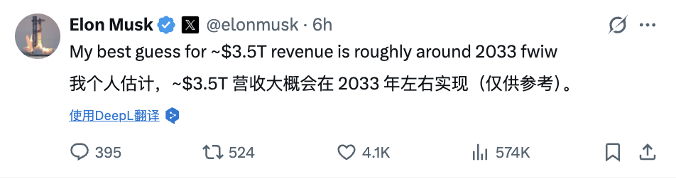
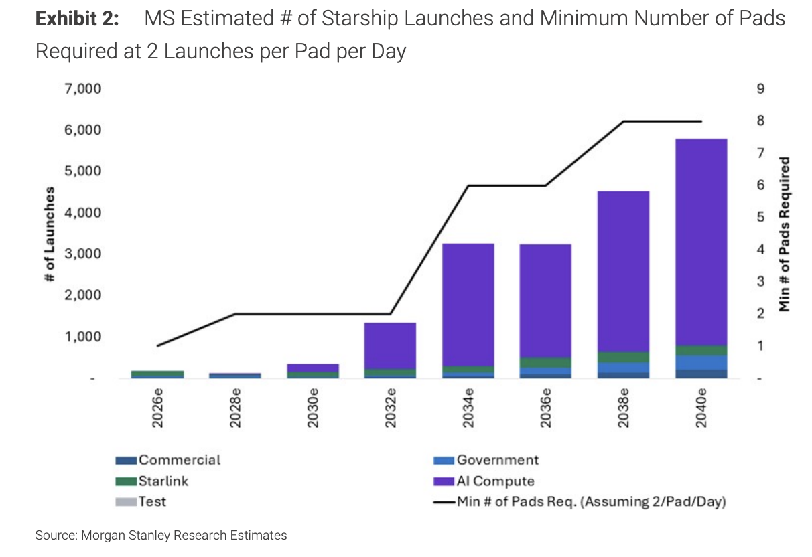
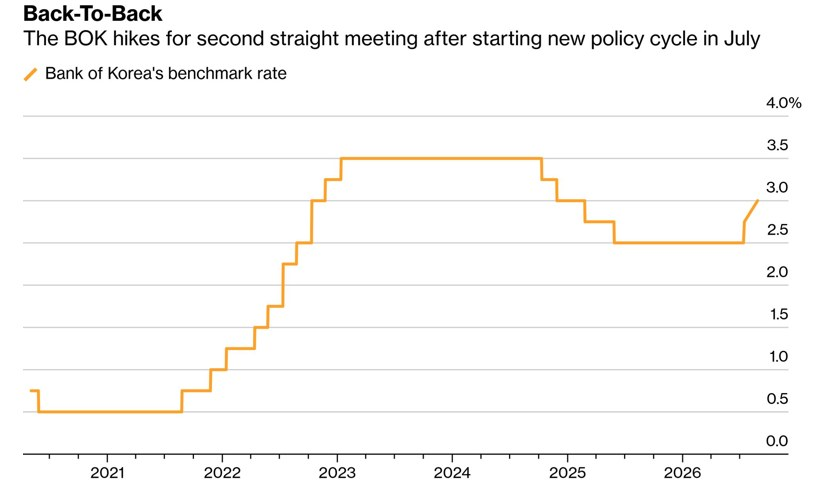
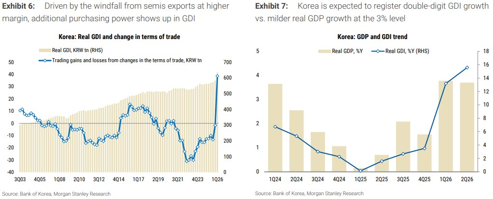
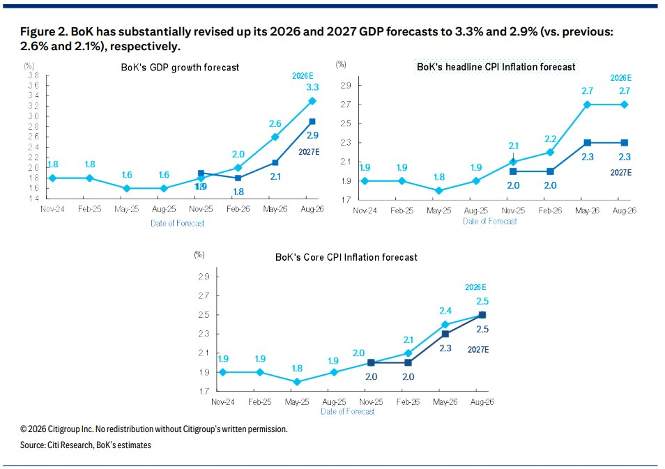

# 头版

> 今日打分最高的几条,不是热度最高的几条。
> 生成于 2026-08-28 13:42 CST · 编号供读完打点,不需要从纸上点链接。

## F01 · 认为“SpaceX被低估”，大摩预测“2040年收入达3.5万亿美元”，马斯克回应“不，我估计2033年就能达到”

> 总分 0.41 · sim 0.65 · len 0.90 · kw 0.50 · hot 0.04 · 批判 6/10
> 挑战了: 触及:假设 — 有反例/前提/边界,启发式加分
> 今天 10:22

SpaceX创始人马斯克公开回应摩根士丹利最新研报，认为大摩对公司收入规模的预测时间线过于保守。这场围绕SpaceX估值与增长潜力的公开讨论，将这家私人航天公司的商业前景再度推至市场焦点。

摩根士丹利分析师Adam Jonas在最新报告中给予SpaceX"增持"评级，目标价300美元，并预测公司2040年收入将达3.5万亿美元。报告发布后，X平台用户Aaron Burnett指出，大摩的预测基于几乎只有SpaceX自身目标一半的假设，且时间节点比公司内部规划晚了约10年。马斯克随即在X平台回应称："我个人估计，约3.5万亿美元的营收大概会在2033年左右实现。"

这一表态意味着，马斯克认为公司实现该收入规模的时间将比大摩预测提前约七年。对投资者而言，若马斯克的判断更接近现实，当前股价所隐含的估值折价将更为显著。摩根士丹利报告指出，SpaceX目前股价约138美元，对应2028年预测收入约10倍市销率，企业AI业务的隐含估值几乎为零。

大摩：SpaceX被低估，给出300美元目标价

摩根士丹利在最新报告中维持对SpaceX的"增持"评级，目标价300美元，较当前股价约137.95美元有逾一倍上涨空间。报告采用分部加总估值法，将SpaceX拆分为太空发射、星链连接、AI（含X与Grok）及企业AI四大业务板块，对应估值分别为每股8美元、118美元、8美元及165美元。

报告认为，当前股价对企业AI业务的定价接近于零，轨道算力业务的期权价值同样未被计入。大摩测算，轨道算力每增加1GW算力（按每瓦50美元、70%增量利润率、10倍EBITDA估值计算），将为股价贡献约27美元，相当于当前股价的约20%。

报告同时指出，SpaceX目前以约10倍2028年预测市销率交易，对应收入增速约70%；以约25倍2028年预测EBIT交易，对应利润增速约113%。大摩认为，这一估值水平对于增长轨迹如此陡峭的公司而言具有吸引力。

路易斯安那州百亿基地：发射能力的战略跃升

报告的直接触发点是SpaceX宣布在路易斯安那州Vermilion Parish建设新发射基地Starbase LA，总投资规模达1000亿美元，计划2027年开工，2029年首次发射。该基地将设置多达10个发射台（5个发射综合体，每个配备2个发射台），并配套推进剂生产设施、发电厂及员工住宅，预计创造约3000个直接就业岗位。

大摩指出，即便不依赖路易斯安那州基地全面投入运营，其2040年约5800次Starship年发射量的预测仅需约8个发射台即可实现。目前SpaceX已规划的发射台总数达15个，分布于德克萨斯州、佛罗里达州及路易斯安那州。

选址路易斯安那州有多重战略考量。其一，该州地理位置允许向南越过墨西哥湾进行极轨道发射，可覆盖从德克萨斯州、佛罗里达州或加利福尼亚州难以实现的晨昏太阳同步轨道，对轨道算力业务具有直接价值。其二，路易斯安那州是全美第三大天然气产区，而每次Starship发射需消耗逾1000吨液态甲烷。其三，在多个州对数据中心和AI基础设施出现跨党派阻力的背景下，分散发射设施的司法管辖区有助于降低监管风险。此外，路易斯安那州还为SpaceX量身定制了一系列激励政策，包括大型航天设施销售税返还、工业税收豁免扩展至航天制造领域，以及针对特定诉讼的责任保护条款。

Starship：降本逻辑与发射规模的核心支撑

大摩报告的估值逻辑高度依赖Starship的成本下降路径与发射频次提升。报告预测，Starship每公斤发射成本将从2025年约1000美元（Falcon 9内部成本）降至2030年约500美元（对应341次发射），2035年降至200美元以下（对应约2600次发射），2040年进一步降至150美元以下（对应约6000次发射）。

大摩将可重复使用火箭类比为"通往太空的电梯"，认为Starship凭借超过Falcon 9五倍以上的最大载荷能力，以及一级和二级均可回收的全复用设计，具备将发射成本再压缩近10倍的现实可能性。

在具体假设上，大摩采取了相对保守的立场。报告假设Starship飞船在2027至2029年间的有效使用寿命不足2次，2030年为3次，2031年为4次，至2040年才达到约43次；助推器方面，报告假设SpaceX需要约8年时间才能达到30次以上复用水平，与Falcon 9的历史迭代节奏基本一致。

报告还指出，SpaceX已宣布完成Falcon 9在佛罗里达州的最后一次星链发射任务，未来所有来自佛罗里达州的星链发射将全部转由Starship执行。由于每次Starship发射的下行容量最高可达Falcon 9的25倍，这一转变对整体发射频次的影响相对有限。

轨道算力：下一个万亿级增长引擎

大摩将轨道算力定位为SpaceX长期估值的核心变量，并在报告中将其列为2032年后发射需求的主要驱动力。报告认为，轨道算力的核心竞争优势并非成本与地面算力的绝对平价，而在于可扩展性与上线速度。

报告援引SpaceX已签署的两笔新云计算合同指出，客户愿意为可即时获取的大规模高端GPU集群支付显著溢价，这与SpaceX发射业务在成本持续下降的同时仍能定期提价的逻辑如出一辙。大摩预测，2027年底SpaceX轨道算力将达4.9GW，而公司自身目标约为10GW。

大摩同时提示，1000亿美元的路易斯安那州基地投资将在10年内分批支出，规模相当于其模型中2026至2035年SpaceX太空业务资本支出的总和，但仅占同期含AI支出在内全部资本开支的约2%。报告坦承，大规模资本支出计划在纸面上易于宣布，但增长必须真正兑现，才能持续支撑SpaceX及债务市场对投资的合理化。

风险提示及免责条款

市场有风险，投资需谨慎。本文不构成个人投资建议，也未考虑到个别用户特殊的投资目标、财务状况或需要。用户应考虑本文中的任何意见、观点或结论是否符合其特定状况。据此投资，责任自负。

**相关报道(已折叠):** SpaceX波动率大幅下降，马斯克再放豪言2033年营收达3.5万亿美元

原文地址(需上网): `https://wallstreetcn.com/articles/3780524`

读完再打点: `uv run main.py feedback --edition 2026-08-28-am --n 1 --label 1` 有用, `--label -1` 无用。没读不要标。

---

## F02 · 比尔·盖茨：就算机器人更便宜，有些工作也必须留给人类

> 总分 0.28 · sim 0.26 · len 0.61 · kw 0.50 · hot 0.04 · 批判 4/10
> 挑战了: 未检测出明确假设挑战 — 中性资讯
> 今天 10:41

前世界首富比尔·盖茨提出“人类保留地”概念，主张陪审、教育、艺术等关乎人际连接的工作即使机器人更高效也应留给人。

此举并非抵制AI，而是为工作赋予意义，或可缩短工时、提前退休。需尽早决策，否则未来真人互动或成奢侈品，加剧不平等，技术狂飙中应为人的价值预留空间。

原文地址(需上网): `https://wallstreetcn.com/charts/41959707`

读完再打点: `uv run main.py feedback --edition 2026-08-28-am --n 2 --label 1` 有用, `--label -1` 无用。没读不要标。

---

## F03 · 连续两次加息！AI繁荣逼韩国央行抢跑，10月步伐是否放缓？

> 总分 0.37 · sim 0.40 · len 1.00 · kw 0.81 · hot 0.04 · 批判 6/10
> 挑战了: 触及:前提 — 有反例/前提/边界,启发式加分
> 今天 09:11

8月27日，韩国央行以6比1压倒性的投票结果将基准七天回购利率上调25个基点至3.00%。这是继7月加息后，韩国央行连续上调基准利率。连续加息打破了该行近年来倾向于“走走停停”评估政策影响的常规操作惯例，超出市场预期。

与加息决议同等重要的是，韩国央行全面且大幅上修了宏观经济预测。2026年GDP增速从5月预测的2.6%上调至3.3%，2027年增速由2.1%上调至2.9%。此次调整反映了央行对经济扩张速度的重新评估——AI驱动的半导体超级周期正通过出口、企业利润、居民收入和投资需求等多重渠道，持续抬升整体经济增速中枢。实际数据已印证这一趋势：Q2韩国GDP同比增长3.7%，环比增长0.6%，显著高于此前预期。

更值得关注的是，韩国国内总收入GDI同比增长达15.6%，表明半导体繁荣已从出口数量的扩张延伸至更深层次的结构性转变——芯片价格上涨与贸易条件改善所释放的增益，正在加速转化为国内收入增长。

通胀方面，尽管维持今年总体消费者通胀率2.7%的预测不变，但将核心通胀率预测进行了上调，预计2026年和2027年核心CPI均为2.5%（此前预测分别为2.4%和2.3%）。而且最新的六个月点阵图显示，在21个预测点位中，有10个集中在3.25%附近，利率中枢较此前显著抬升。

韩国央行在声明中指出，强劲的半导体出口正推动资本支出扩张和收入改善，需求侧压力正逐渐成为通胀的主要来源。虽然7月份韩国整体CPI回落至2.8%，但核心通胀仍达到2.6%，韩国央行显然担心强劲收入最终向消费、工资和服务价格扩散。

韩国央行连续加息是为了在通胀预期重新固化之前提前行动。韩国央行行长申铉松以“先用小锄头，而非等待使用大铲子”解释政策逻辑：在经济能够承受紧缩时主动收紧，以避免未来通胀问题扩大后不得不采取更猛烈的加息。

这一系列动作也在表明，韩国经济已从单纯的供给冲击复苏阶段，过渡至需警惕需求过热的阶段。

AI繁荣驱动央行政策重心转向抑制需求型通胀

原文地址(需上网): `https://wallstreetcn.com/member/articles/3780487`

读完再打点: `uv run main.py feedback --edition 2026-08-28-am --n 3 --label 1` 有用, `--label -1` 无用。没读不要标。

---
