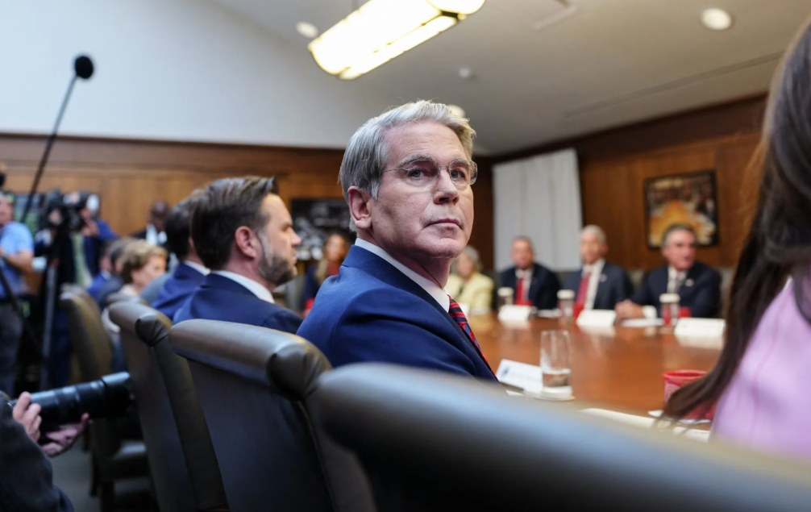
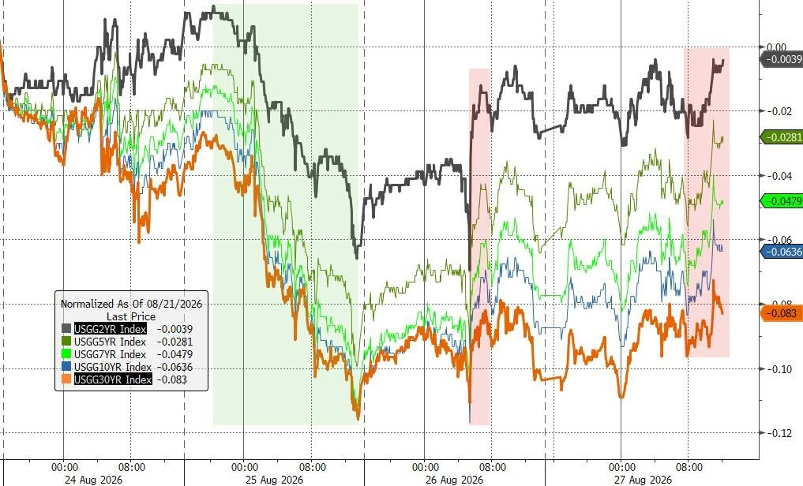
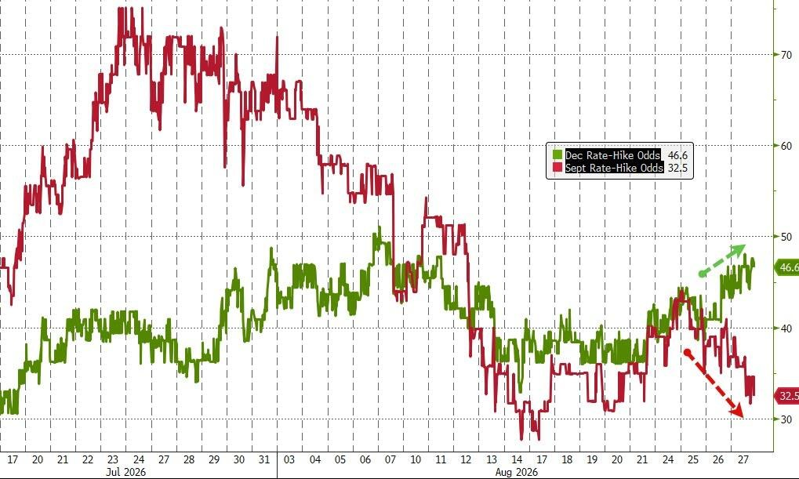

# 今日一问

> 批判性思考分最高的内容。允许它和你的口味不太像。
> 生成于 2026-08-28 13:44 CST · 编号供读完打点,不需要从纸上点链接。

## F12 · “新美联储通讯社”：历史重演，当面对战争，贝森特试探“美联储与财政部的界限”

> 总分 0.33 · sim 0.42 · len 0.93 · kw 0.56 · hot 0.04 · 批判 6/10
> 挑战了: 触及:前提 — 有反例/前提/边界,启发式加分
> 今天 08:46

8月27日，《华尔街日报》刊发了一篇由资深记者、“新美联储通讯社”之称的Nick Timiraos撰写的深度报道。

报道发出的时间节点颇为微妙——正值堪萨斯城联储年度经济政策研讨会（杰克逊霍尔央行会议）召开前夕，美联储主席凯文·沃什即将登台发言，而美国财政部长贝森特的一系列动作，已成为与会央行官员场外讨论最热的话题之一。

文章发问称：贝森特究竟走了多远？ 他的债市操作、对美联储人事的关注、以及对货币政策的公开表态，是否已经越过了财政部与美联储之间那条历史划定的边界？

这条边界并非天然存在。它诞生于1951年，脱胎于一场战争，而今天，历史的回响再度响起。

一纸公告，搅动市场

上周，贝森特宣布财政部将至少翻倍回购长期国债的规模。

这一公告的时机格外引人注目——距离财政部上一次季度例行发布会仅过去两周，而此类政策调整通常在季度例会上宣布。财政部长期以来向投资者承诺，债务管理将“定期且可预测”，而非机会主义式操作。

贝森特给出的理由是：当前长期国债收益率已触及19年高位，“不能反映基本面”。他的目标，是通过扩大回购来压低长端收益率，降低政府融资成本。

Nick Timiraos认为，问题在于，这恰恰发生在美联储可能希望收紧金融条件的时刻。如果财政部的操作成功压低了长端利率，等于在美联储还没动手的情况下，提前松开了货币政策的“阀门”。

知名投资人、贝森特曾经的导师Stanley Druckenmiller本周撰文评论，直接批评这一回购计划是“价格管理”，并称其“是一个错误”。

贝森特的“多线出击”

债市回购只是贝森特近期动作的一部分。

Nick Timiraos写道，本月早些时候，他向美联储施压，要求为外国央行提供更多美元流动性，目的是支持日本在不抛售美国国债的前提下干预汇市、支撑日元——因为一旦日本大规模抛售美债，将直接推高美债收益率。

与此同时，贝森特还对亚特兰大联储行长的人选表现出兴趣。该职位自今年3月起悬空至今。

更早之前，特朗普政府还指示政府控股的房利美和房地美增加对抵押贷款支持证券的购买，以压低抵押贷款利率。

这一系列操作叠加在一起，让外界开始追问：财政部是否正在系统性地寻找各种杠杆，以绕开美联储、直接影响市场利率？

“对沃什来说是真正的麻烦”

Nick Timiraos在文中引用曾担任过去三任美联储主席顾问的乔恩·福斯特（Jon Faust）措辞写道：

贝森特的言行对沃什来说是真正的麻烦。在通胀高企之际，货币政策可能被从属于政府融资需求，这一担忧本已存在。而他偏偏选在杰克逊霍尔前夕这么做，在我看来，这相当不体贴，甚至可以说是一记耳光。

这位顾问还指出，美联储利率决策委员会（FOMC）内部本已分歧明显——上个月就有三位官员投票支持加息。如果贝森特的债市干预成功压低长端利率和借贷成本，“这肯定会推动FOMC中的大多数人进一步倾向于加息”。

对此，财政部方面予以反驳。财政部发言人表示：“在全球金融危机之前，债务管理决策完全由财政部自行决定。在贝森特部长领导下，财政部正在收回这些权力，以履行其使命——以尽可能低的长期成本为美国纳税人融资。”

贝森特本人也表示，债务回购“不会干扰货币政策”，财政部和美联储“如果资产负债表有任何变化，将会协同合作”。

沃什的两难

这场争议对美联储主席沃什而言，来得尤为棘手。

Nick Timiraos提及，沃什上任后一直强调，美联储应该“少说”未来政策走向，以便从市场价格中获得“未经过滤的真实信号”。上个月，他还专门援引上升的国债收益率，作为债券市场正在自发收紧金融条件的证据。

但现在，这些收益率的走势，可能已经掺入了财政部干预的成分，而非纯粹反映投资者对经济前景的判断。这让沃什赖以观察市场的“温度计”，变得不那么可靠了。

麻省理工学院教授、前欧洲央行官员阿塔纳西奥斯·奥尔法尼德斯（Athanasios Orphanides）则持相对温和的立场。他表示，财政部有权按其认为合适的方式管理债务，美联储的职责不是质疑这些政策，但应将其经济影响纳入利率决策的考量。

明尼阿波利斯联储主席尼尔·卡什卡利本周在电视采访中表示，他没有看到近期债市抛售令美联储工作更加困难的迹象，国债市场“运转正常”。

历史的回响：从1951年到今天

财政部与美联储之间的边界，并非一直清晰。

Nick Timiraos称，二战期间，美联储曾同意压低国债收益率，以协助政府为战争融资。这一安排直到1951年才随着一份协议的签署而终结——彼时，双方正为如何为朝鲜战争买单而争执不下。那份协议，如今被视为美联储独立性的起点。

战争还催生过另一个著名的历史场景：1965年，林登·约翰逊总统将时任美联储主席威廉·麦克切斯尼·马丁召至德克萨斯州的农场，当面训斥他在越战期间加息的决定。

沃什去年曾谈及要撰写一份“1951年协议的更新版本”。而今天，他面对的，是另一场战争引发的新一轮通胀压力，而贝森特正主导着旨在结束这场战争的经济外交。

风险提示及免责条款

市场有风险，投资需谨慎。本文不构成个人投资建议，也未考虑到个别用户特殊的投资目标、财务状况或需要。用户应考虑本文中的任何意见、观点或结论是否符合其特定状况。据此投资，责任自负。

原文地址(需上网): `https://wallstreetcn.com/articles/3780514`

读完再打点: `uv run main.py feedback --edition 2026-08-28-am --n 12 --label 1` 有用, `--label -1` 无用。没读不要标。

---

## F13 · 沃什杰克逊霍尔讲话料乏善可陈，沃勒9月表态或更具交易价值

> 总分 0.24 · sim 0.39 · len 1.00 · kw 0.56 · hot 0.04 · 批判 6/10
> 挑战了: 触及:然而 — 有反例/前提/边界,启发式加分
> 今天 05:13

周五，美联储主席凯文·沃什将在杰克逊霍尔讲话，可能将再度令寄望于明确政策信号的债券交易员失望。真正具有交易价值的时刻，或许要等到理事沃勒下周开口才会到来。

多重迹象显示，沃什将延续其上任以来惜字如金的沟通风格，不就利率走向发出明确信号。这意味着金融市场在相当程度上仍需依赖新公布的经济数据自行研判政策方向。

若讲话后美债出现抛售，市场人士认为，这更多反映的是投资者对"无前瞻指引"新框架的适应过程，而非美联储抗通胀公信力的实质性动摇。

彭博分析指出，能够为市场提供更多可操作线索的，是沃勒定于9月3日发表的讲话。届时距9月15日至16日FOMC会议前静默期开启仅剩两天，其表态的市场权重将因此大幅提升。

沃什风格已成市场痼疾，债市苦于政策方向不明

自执掌美联储以来，沃什刻意保持措辞模糊，将政策信号的解读权更多留给市场和数据，而非通过前瞻指引主动引导预期。这一风格在债市引发持续困扰。

当前，30年期美债收益率已接近近20年高位，是市场在政策不确定性下最容易遭受冲击的方向之一。

与此同时，SOFR期货定价显示，美联储9月加息的概率超过30%，短期利率预期相对稳定，而长端则更为脆弱。

沃勒曾将模糊转化为信号，本次讲话背景更为关键

如果说沃什定义了美联储当前的沟通风格，那么沃勒承担的则是政策反应函数的传达角色。

今年7月，在6月CPI数据公布前，沃勒曾将沃什的含糊立场转化为市场可以直接交易的信息。他明确表示，若核心通胀再度偏热，美联储将需要考虑近期加息。

然而此后形势发生变化。核心CPI同比增速在6月与7月均出现回落，本周三公布的PCE数据亦表现温和，令加息预期有所降温。

这使得沃勒下周讲话的分量更加突出。值得注意的是，本次活动的主题正是通胀前景与美联储政策应对，切中当前市场最核心的关切。

9月3日的讲话距FOMC会议前静默期开始仅有两天，是本轮会议前官员公开发声的最后实质性窗口。

风险提示及免责条款

市场有风险，投资需谨慎。本文不构成个人投资建议，也未考虑到个别用户特殊的投资目标、财务状况或需要。用户应考虑本文中的任何意见、观点或结论是否符合其特定状况。据此投资，责任自负。

原文地址(需上网): `https://wallstreetcn.com/articles/3780503`

读完再打点: `uv run main.py feedback --edition 2026-08-28-am --n 13 --label 1` 有用, `--label -1` 无用。没读不要标。

---

## F14 · 老黄“霸气宣言”：我们遥遥领先！

> 总分 0.35 · sim 0.30 · len 0.67 · kw 0.76 · hot 0.04 · 批判 5/10
> 挑战了: 未检测出明确假设挑战 — 中性资讯
> 今天 10:11

黄仁勋表示，尽管市场上不断出现各种XPU和AI芯片初创公司，但芯片研发门槛极高，很多项目最终都会被取消。英伟达深耕这一领域33年，拥有技术、供应链和规模优势，不仅有信心继续为合作伙伴提供最高效的AI基础设施、成为其最大供应商，而且目前市场份额仍在扩大，增长还在加速，技术领先优势也在继续拉大，因此他对所有竞争都非常从容。

原文地址(需上网): `https://wallstreetcn.com/charts/41959706`

读完再打点: `uv run main.py feedback --edition 2026-08-28-am --n 14 --label 1` 有用, `--label -1` 无用。没读不要标。

---
