# 自动日报 · 早报 · 2026-08-28-am

> 期号 `2026-08-28-am` · 生成于 2026-08-28 13:46 CST
> 版面 7 · 失败 0

# 口播

> 合集按天滴灌，订阅 UP 新片转写后见报。不进头版打分。 · 2026-08-28 13:42 CST

## 从海鲜开始：鱼的鲜味和腥味，及去腥的科学方法。

> 2022年7月11日 · bilibili · 合集·硬核烹饪指南Scientific Cooking Guide

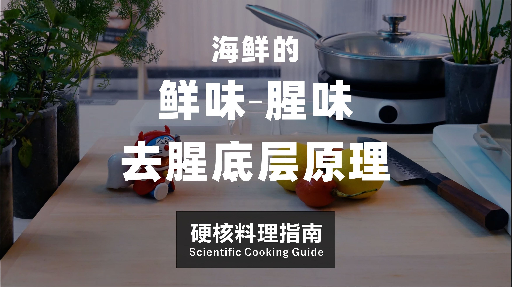

# 从海鲜开始：鱼的鲜味、腥味及去腥的科学方法

从科学和底层逻辑的角度来分享关于食材本身和食材的搭配。这期先聊鱼：鱼的鲜味和鱼腥味，以及怎么去腥。总结起来就是香料、酸和酒。

大部分香料都有抑制腥味的作用，但只体现在腌制阶段。去腥靠的主要还是香料中挥发性的风味物对腥味的掩盖作用。酸类则有去除腥味分子的作用，包括和腥味分子反应，或者是抑制其前体的生成。酒的使用则是通过提高腥味物质的萃取效率来达到去腥的效果。同时酒本身的挥发性风味物也有掩盖的作用。酒的酯类也会和鱼肉的粗脂反应，产生复杂的风味物，带来额外的香气，比如脂类和其中的酸类可能发生的酯化反应。

还有一类基础的去腥方法就是物理方法，包括清水冲洗、去除内脏、排血、去除粘液，还有盐的腌制。实际烹饪中，食材的去腥作用不是单一的。柠檬皮在挤压的时候带入的精油属于香料类，柠檬汁本身则是酸类。茴香酒是香料和酒类的结合。白葡萄酒本身的酸度和迷人风味的酒体，在烹饪中则是兼具酸类和酒类的双重去腥作用。我们熟悉的葱姜盐水腌鱼，则是香料的去腥作用和盐的去腥作用的结合。

从基础的数据来看，鱼肉和畜肉禽肉的蛋白质含量相比并没有明显的差别，但鱼肉的鲜味氨基酸含量普遍要高一些。虽然也有吊车尾，比如鲢鱼就比不过牛肉。所以准确来说应该是鱼肉的鲜味氨基酸的上限要比牛羊猪和鸡肉要高。鱼死亡后，鱼肉蛋白质分解出来的小分子氨基酸，像甘氨酸就有显著的甜味，谷氨酸的钠盐、天冬氨酸、组氨酸等等就是典型的鲜味。负责储存和产生能量的三磷酸腺苷，在鱼死亡后也会逐渐变成具有鲜味的肌苷酸。另外，鱼肉中的琥珀酸、嘌呤类和氧化三甲胺也是体现鱼肉鲜味和风味的主要物质。这几个方面综合起来就表现出了鱼肉的鲜味。这也让鱼类或者是其他的海洋生物的肉质比其他的物种吃起来更鲜美。

鱼死亡后，细菌和酵素会分解氧化三甲胺，转化成有味道的三甲胺。鱼肉中为了适应低温而演化出来的高度不饱和脂肪酸也很容易氧化和分解。肉中的自由脂肪酸的片段也会和氧化三甲胺发生一系列的反应。综合起来，上面这些反应产生的挥发性分子就表现出了鱼腥味。

要想去掉腥味，第一是抑制产生挥发性腥味分子的反应，第二是直接的去掉产生腥味的挥发性分子，第三是用能产生挥发性的香气的食材来直接的掩盖腥味。

能产生第一种抑制作用的食材，比如葱属的洋葱、大小葱、韭菜、蒜，香料类的生姜、鼠尾草、薄荷、紫苏、香叶，黑白胡椒、青红花椒，还有丁香、肉桂等等。还有特别的，有出色的抗氧化性的绿茶，比如龙井茶。但在实际中，更多的是利用食材带有的强烈香气去掩盖腥味。因为抑制作用只有在腌制的时候才能体现出抑制和减缓腥味产生的效果，而在烹饪阶段产生腥味的反应已经停止了。所以上面提到的抑制腥味的食材，在实际烹饪中更多的是通过强烈芳香气味去掩盖腥味。

通过第二种方式去除腥味的是酸类。这里的酸包括柠檬等柑橘类的酸、白醋、黑醋、白葡萄酒醋的酸，也可以是番茄、百香果、酸木瓜的酸，当然还有白葡萄酒中的酸等等，都可以和碱性的腥味分子三甲胺反应，从而达到去腥的目的。除此之外，酸还可以在一定程度上分解淡水鱼，像鲶鱼、罗非鱼、鲤鱼的鱼肉中的土味素。土味素也就是淡水鱼的土腥味来源之一，主要是因为淡水鱼食用蓝绿藻而在体内积累土味素。泥土中的放线菌代谢产生的六氢吡啶类和鱼表面的乙醛结合的产物，以及鱼体表粘液被细菌分解后产生的氨类、吲哚类物质，也都会体现出腥臭味。所以淡水鱼的腥味相比于海鱼来说更复杂，酸和香料的使用只能是在一定程度上去除淡水鱼的土腥味，但并不是所有的淡水鱼就有土腥味。像桂鱼，也就是桂花鱼，就是没有土腥味的优秀淡水鱼。罗非鱼是淡水鱼，会有典型的土腥味。煎罗非鱼排的时候可以加入柠檬汁。小技巧是挤完汁的柠檬不要丢，而是直接丢到锅里面一起焖煮，充分的利用柠檬皮的挥发性的精油，在蒸汽的循环下对流，去覆盖整个鱼身。柠檬汁的酸和柠檬皮中含有的挥发性精油都可以起到很好的去腥作用。

除了酸，酒也是去除挥发性腥味分子的重要手段。腥味的氨类以及其他的物质在乙醇中本来就有很高的溶解度，加上乙醇在生物组织之间的很强的渗透性。烹饪中加入酒后，乙醇对三甲胺等腥味物质就有了更高的萃取效率，能更高效的使挥发性的腥味分子挥发。再加上酒本身带来的风味物质，最终就达到了去腥增香的效果。所以酒本身并没有抑制腥味的作用，更多的是通过强渗透性来贡献对腥味分子更高的萃取效率，以及酒本身的风味和香气来增强菜的风味。

另一种必要的物理方法是买回来的鱼要用清水清洗，有粘液的要刮掉。因为鱼表面附着了氧化了的脂肪和表面细菌产生的氨类物质，像黑鱼、黄骨鱼、鳗鱼、鲶鱼、青衣等等，这些都是粘液很多的鱼。去掉粘液，也就等于去掉了一大半的腥味来源。传统的葱姜盐水腌鱼，实际上也是一种物理方法。原理是通过盐的渗透作用，使含有腥味物质的鱼肉汁液析出，以及葱姜香味的掩盖作用。当然再加一点料酒和酸味的柠檬汁，效果更佳。腥味含量拉满的腌鱼汁就不要再使用了，鱼也要重新清洗后再进行烹饪。

原文地址(需上网,纸上看不到点): `https://www.bilibili.com/video/BV1Fe4y1R7xH`

---

---

# 头版

> 今日打分最高的几条,不是热度最高的几条。
> 生成于 2026-08-28 13:42 CST · 编号供读完打点,不需要从纸上点链接。

## F01 · 认为“SpaceX被低估”，大摩预测“2040年收入达3.5万亿美元”，马斯克回应“不，我估计2033年就能达到”

> 总分 0.41 · sim 0.65 · len 0.90 · kw 0.50 · hot 0.04 · 批判 6/10
> 挑战了: 触及:假设 — 有反例/前提/边界,启发式加分
> 今天 10:22

SpaceX创始人马斯克公开回应摩根士丹利最新研报，认为大摩对公司收入规模的预测时间线过于保守。这场围绕SpaceX估值与增长潜力的公开讨论，将这家私人航天公司的商业前景再度推至市场焦点。

摩根士丹利分析师Adam Jonas在最新报告中给予SpaceX"增持"评级，目标价300美元，并预测公司2040年收入将达3.5万亿美元。报告发布后，X平台用户Aaron Burnett指出，大摩的预测基于几乎只有SpaceX自身目标一半的假设，且时间节点比公司内部规划晚了约10年。马斯克随即在X平台回应称："我个人估计，约3.5万亿美元的营收大概会在2033年左右实现。"

这一表态意味着，马斯克认为公司实现该收入规模的时间将比大摩预测提前约七年。对投资者而言，若马斯克的判断更接近现实，当前股价所隐含的估值折价将更为显著。摩根士丹利报告指出，SpaceX目前股价约138美元，对应2028年预测收入约10倍市销率，企业AI业务的隐含估值几乎为零。

大摩：SpaceX被低估，给出300美元目标价

摩根士丹利在最新报告中维持对SpaceX的"增持"评级，目标价300美元，较当前股价约137.95美元有逾一倍上涨空间。报告采用分部加总估值法，将SpaceX拆分为太空发射、星链连接、AI（含X与Grok）及企业AI四大业务板块，对应估值分别为每股8美元、118美元、8美元及165美元。

报告认为，当前股价对企业AI业务的定价接近于零，轨道算力业务的期权价值同样未被计入。大摩测算，轨道算力每增加1GW算力（按每瓦50美元、70%增量利润率、10倍EBITDA估值计算），将为股价贡献约27美元，相当于当前股价的约20%。

报告同时指出，SpaceX目前以约10倍2028年预测市销率交易，对应收入增速约70%；以约25倍2028年预测EBIT交易，对应利润增速约113%。大摩认为，这一估值水平对于增长轨迹如此陡峭的公司而言具有吸引力。

路易斯安那州百亿基地：发射能力的战略跃升

报告的直接触发点是SpaceX宣布在路易斯安那州Vermilion Parish建设新发射基地Starbase LA，总投资规模达1000亿美元，计划2027年开工，2029年首次发射。该基地将设置多达10个发射台（5个发射综合体，每个配备2个发射台），并配套推进剂生产设施、发电厂及员工住宅，预计创造约3000个直接就业岗位。

大摩指出，即便不依赖路易斯安那州基地全面投入运营，其2040年约5800次Starship年发射量的预测仅需约8个发射台即可实现。目前SpaceX已规划的发射台总数达15个，分布于德克萨斯州、佛罗里达州及路易斯安那州。

选址路易斯安那州有多重战略考量。其一，该州地理位置允许向南越过墨西哥湾进行极轨道发射，可覆盖从德克萨斯州、佛罗里达州或加利福尼亚州难以实现的晨昏太阳同步轨道，对轨道算力业务具有直接价值。其二，路易斯安那州是全美第三大天然气产区，而每次Starship发射需消耗逾1000吨液态甲烷。其三，在多个州对数据中心和AI基础设施出现跨党派阻力的背景下，分散发射设施的司法管辖区有助于降低监管风险。此外，路易斯安那州还为SpaceX量身定制了一系列激励政策，包括大型航天设施销售税返还、工业税收豁免扩展至航天制造领域，以及针对特定诉讼的责任保护条款。

Starship：降本逻辑与发射规模的核心支撑

大摩报告的估值逻辑高度依赖Starship的成本下降路径与发射频次提升。报告预测，Starship每公斤发射成本将从2025年约1000美元（Falcon 9内部成本）降至2030年约500美元（对应341次发射），2035年降至200美元以下（对应约2600次发射），2040年进一步降至150美元以下（对应约6000次发射）。

大摩将可重复使用火箭类比为"通往太空的电梯"，认为Starship凭借超过Falcon 9五倍以上的最大载荷能力，以及一级和二级均可回收的全复用设计，具备将发射成本再压缩近10倍的现实可能性。

在具体假设上，大摩采取了相对保守的立场。报告假设Starship飞船在2027至2029年间的有效使用寿命不足2次，2030年为3次，2031年为4次，至2040年才达到约43次；助推器方面，报告假设SpaceX需要约8年时间才能达到30次以上复用水平，与Falcon 9的历史迭代节奏基本一致。

报告还指出，SpaceX已宣布完成Falcon 9在佛罗里达州的最后一次星链发射任务，未来所有来自佛罗里达州的星链发射将全部转由Starship执行。由于每次Starship发射的下行容量最高可达Falcon 9的25倍，这一转变对整体发射频次的影响相对有限。

轨道算力：下一个万亿级增长引擎

大摩将轨道算力定位为SpaceX长期估值的核心变量，并在报告中将其列为2032年后发射需求的主要驱动力。报告认为，轨道算力的核心竞争优势并非成本与地面算力的绝对平价，而在于可扩展性与上线速度。

报告援引SpaceX已签署的两笔新云计算合同指出，客户愿意为可即时获取的大规模高端GPU集群支付显著溢价，这与SpaceX发射业务在成本持续下降的同时仍能定期提价的逻辑如出一辙。大摩预测，2027年底SpaceX轨道算力将达4.9GW，而公司自身目标约为10GW。

大摩同时提示，1000亿美元的路易斯安那州基地投资将在10年内分批支出，规模相当于其模型中2026至2035年SpaceX太空业务资本支出的总和，但仅占同期含AI支出在内全部资本开支的约2%。报告坦承，大规模资本支出计划在纸面上易于宣布，但增长必须真正兑现，才能持续支撑SpaceX及债务市场对投资的合理化。

风险提示及免责条款

市场有风险，投资需谨慎。本文不构成个人投资建议，也未考虑到个别用户特殊的投资目标、财务状况或需要。用户应考虑本文中的任何意见、观点或结论是否符合其特定状况。据此投资，责任自负。

**相关报道(已折叠):** SpaceX波动率大幅下降，马斯克再放豪言2033年营收达3.5万亿美元

原文地址(需上网): `https://wallstreetcn.com/articles/3780524`

读完再打点: `uv run main.py feedback --edition 2026-08-28-am --n 1 --label 1` 有用, `--label -1` 无用。没读不要标。

---

## F02 · 比尔·盖茨：就算机器人更便宜，有些工作也必须留给人类

> 总分 0.28 · sim 0.26 · len 0.61 · kw 0.50 · hot 0.04 · 批判 4/10
> 挑战了: 未检测出明确假设挑战 — 中性资讯
> 今天 10:41

前世界首富比尔·盖茨提出“人类保留地”概念，主张陪审、教育、艺术等关乎人际连接的工作即使机器人更高效也应留给人。

此举并非抵制AI，而是为工作赋予意义，或可缩短工时、提前退休。需尽早决策，否则未来真人互动或成奢侈品，加剧不平等，技术狂飙中应为人的价值预留空间。

原文地址(需上网): `https://wallstreetcn.com/charts/41959707`

读完再打点: `uv run main.py feedback --edition 2026-08-28-am --n 2 --label 1` 有用, `--label -1` 无用。没读不要标。

---

## F03 · 连续两次加息！AI繁荣逼韩国央行抢跑，10月步伐是否放缓？

> 总分 0.37 · sim 0.40 · len 1.00 · kw 0.81 · hot 0.04 · 批判 6/10
> 挑战了: 触及:前提 — 有反例/前提/边界,启发式加分
> 今天 09:11

8月27日，韩国央行以6比1压倒性的投票结果将基准七天回购利率上调25个基点至3.00%。这是继7月加息后，韩国央行连续上调基准利率。连续加息打破了该行近年来倾向于“走走停停”评估政策影响的常规操作惯例，超出市场预期。

与加息决议同等重要的是，韩国央行全面且大幅上修了宏观经济预测。2026年GDP增速从5月预测的2.6%上调至3.3%，2027年增速由2.1%上调至2.9%。此次调整反映了央行对经济扩张速度的重新评估——AI驱动的半导体超级周期正通过出口、企业利润、居民收入和投资需求等多重渠道，持续抬升整体经济增速中枢。实际数据已印证这一趋势：Q2韩国GDP同比增长3.7%，环比增长0.6%，显著高于此前预期。

更值得关注的是，韩国国内总收入GDI同比增长达15.6%，表明半导体繁荣已从出口数量的扩张延伸至更深层次的结构性转变——芯片价格上涨与贸易条件改善所释放的增益，正在加速转化为国内收入增长。

通胀方面，尽管维持今年总体消费者通胀率2.7%的预测不变，但将核心通胀率预测进行了上调，预计2026年和2027年核心CPI均为2.5%（此前预测分别为2.4%和2.3%）。而且最新的六个月点阵图显示，在21个预测点位中，有10个集中在3.25%附近，利率中枢较此前显著抬升。

韩国央行在声明中指出，强劲的半导体出口正推动资本支出扩张和收入改善，需求侧压力正逐渐成为通胀的主要来源。虽然7月份韩国整体CPI回落至2.8%，但核心通胀仍达到2.6%，韩国央行显然担心强劲收入最终向消费、工资和服务价格扩散。

韩国央行连续加息是为了在通胀预期重新固化之前提前行动。韩国央行行长申铉松以“先用小锄头，而非等待使用大铲子”解释政策逻辑：在经济能够承受紧缩时主动收紧，以避免未来通胀问题扩大后不得不采取更猛烈的加息。

这一系列动作也在表明，韩国经济已从单纯的供给冲击复苏阶段，过渡至需警惕需求过热的阶段。

AI繁荣驱动央行政策重心转向抑制需求型通胀

原文地址(需上网): `https://wallstreetcn.com/member/articles/3780487`

读完再打点: `uv run main.py feedback --edition 2026-08-28-am --n 3 --label 1` 有用, `--label -1` 无用。没读不要标。

---

---

# 深度阅读

> 更像收藏夹里那种长度和口味的长文。
> 生成于 2026-08-28 13:42 CST · 编号供读完打点,不需要从纸上点链接。

## F04 · 今日知乎日报

> 总分 0.21 · sim 0.43 · len 0.87 · kw 0.00 · hot 0.04 · 批判 4/10
> 挑战了: 像营销或标题党 — 命中低分特征
> 今天 08:39

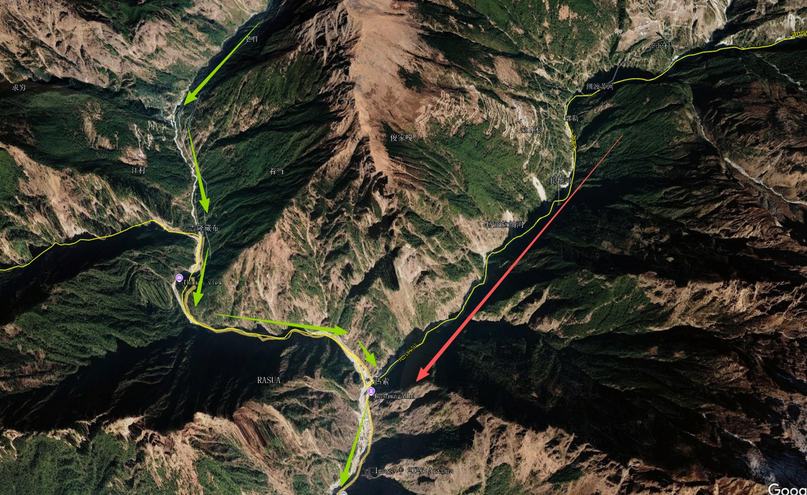
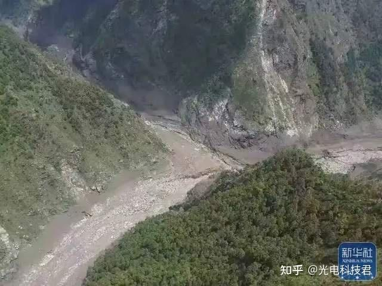

**尼泊尔山洪死亡人数升至 389 人，910 人失联，目前当地情况怎么样？；吉隆口岸方向发现堰塞湖，未来 3 天溃泄风险高，对救援有怎样的影响？；日本艺术家草间弥生去世，终年 97 岁，如何看待她从边缘到顶流的一生？；DeepSeek Harness 被曝出极危漏洞，具体情况如何？**

嘿，这里是知乎早报！

编辑部小李为广大知友准备了每日必看的热点消息和编辑精选的优质内容，更有答主精彩回答等你解锁。

热点速递｜BREAKING NEWS

1、尼泊尔山洪死亡人数升至 389 人，910 人失联，目前当地情况怎么样？

背景：据尼泊尔警方通报，截至当地时间 8 月 27 日 13 时 30 分，尼泊尔山洪死亡人数已升至 389 人。26 日，尼泊尔北部热索瓦地区暴发山洪。目前，尼泊尔有关部门正在展开搜寻和救援工作。

@nesmto：从洪峰情况看，日喀则吉隆口岸的灾害是一次冰湖溃决型泥石流，来源于蓝塘里壤峰东侧冰川的可能性最大。

冰湖溃决型泥石流，是指冰川作用区的高山冰湖因某种原因突然溃决，湖水裹挟湖盆及沟道内大量冰碛物、崩滑堆积物，沿沟道高速下泄形成的泥石流。它是冰湖溃决洪水（GLOF）在含沙量极高、固体物质丰富条件下发展成的特殊灾害形式，兼具洪水与泥石流双重特性。三者关系可理解为：冰湖溃决 → 溃决洪水 → 沟道中卷入泥沙石块 → 演化为溃决型泥石流。当水流含沙量大、黏度增高时，破坏力较纯洪水成倍放大。

特亚拉纳河只是吉隆藏布的二级支流，流域面积约 888 km²，日常径流量只有几十 m³/s，再加上天气较为平稳，降雨造成洪水的可能性较低。只有足够大的水体突然溃决，才可能形成如此大的洪峰。更容易融化溃决的，是海拔较低的冰川体。所以推测蓝塘里壤峰东侧，海拔 4300 m，宽 600 m，长 5000 m 的冰川末端冰碛体溃决造成灾害的可能性最大。

2、吉隆口岸方向发现堰塞湖，未来 3 天溃泄风险高，对救援有怎样的影响？要注意防范哪些次生灾害？

背景：尼泊尔错坚河汇入普热普强藏布的交汇处附近出现明显堰塞湖，截至今天上午估算水量达到 200 万立方米，已经处于漫溢状态，未来 3 天预计还有 300 万立方米水将会入湖，溃泄风险高。目前水利部正在密切监视堰塞湖动态，同时对可能溃泄洪水进行演算分析，为抢险救援提供支撑。

@光电科技君 最担心的事情还是发生了……吉隆口岸方向发现了堰塞湖堵塞，泥石流边缘距吉隆口岸约 2.5 公里，泥石流边缘的厚度接近 1.5 米，这给后续救援带来了很大困难。

实际上，此次泥石流的成因也基本可以查明，位于尼泊尔境内的蓝塘理壤雪山雪山北壁（Langtang Lirung，海拔 7227，世界第 99 高峰）山体冰斗溃决，携带碎石、泥沙从海拔 5000 米左右下冲进河谷，在重大势能作用下，冰雪融水、冰川、夹带大量的岩石和泥沙形成泥石流冲击河谷建筑。

每年的夏季也是藏南、尼北雨季，连续的降雨山体含水量 100% 饱和，山体完全悬空松动，属于一碰就垮的临界状态。因此一般的预警和监测已经无法做到起到效果，再加上事发源头还处于尼泊尔境内。以及事态发展迅速即便能有预警也没有办法撤离。

3、日本艺术家草间弥生去世，终年 97 岁，如何看待她从边缘到顶流的一生？她留给当代艺术界哪些重要的艺术遗产？

背景：当地时间 8 月 27 日，日本艺术家草间弥生本月 14 日因多器官衰竭在东京一家医院去世，终年 97 岁。

@彩色的煤球：草间弥生去世，终年 97 岁。我很难说这是「巨星陨落」，因为她这一生，本就是从黑暗里升起来的。她用将近一个世纪的时间，把自己从一个被幻觉折磨、被家庭驱逐、被祖国唾骂的边缘人，活成了全球拍卖榜上最贵的女艺术家。

但在她身后，真正留下的，不是那些天价南瓜和波点，也不是打破纪录的成交额，是她用身体和生命反复验证过的一件事：艺术可以成为一个人最后的自救，而且，它真的能奏效。

她留给我们的，不是难过，而是一份很轻、又很长的安静，像一个你抬头就能看见的、在里微微转动的南瓜。她的痛苦，曾像一口深井，可她用一辈子，把这口井挖成了海。现在，我们都在她的海里，被她的波点包围，被她那套「我害怕，所以我创作；我创作，所以我不再只是那个害怕的人」的逻辑，轻轻托住。

4、DeepSeek Harness 被曝出极危漏洞，具体情况如何？会造成哪些影响？

背景：奇安信威胁情报中心披露，DeepSeek Harness（DSH）未授权远程代码执行漏洞。漏洞编号 QVD‑2026‑57410，漏洞评级为极危，CVSS 3.0 评分高达 9.8，目前该漏洞 POC 已经公开。

@Archimon ：这个「极危漏动」简单来说是这样：开发者看着 dsh，告诉他不要点陌生链接，更不要点陌生网页「我同意」，否则就会嗖地一下点击恶意链接下载了从熊猫烧香到勒索病毒的所有木马，让此电脑彻底沦为肉鸡。只有浏览器说了是自己人才安全，才能点。

但在现实处理中，dsh 只记住了后面半句话「自己人才安全」，忘记了前面半句话「只有浏览器说」，然后就遇上了一些「自称是自己人」的请求，接受后发现她告诉你她加错人了，但这也算是缘分，哦对了，她还有个爷爷，在老家的山里种了一亩茶叶......然后，右下角的计算器就弹出来了。

更严谨地说法是这样，Deepseek harness 在设计层面只考虑了防范「陌生网页借浏览器攻击」，却没有考虑到「自己可能被暴露在公网上被直接访问」。所以它只考虑对于浏览器请求进行鉴别，而没有真正意义上身份认证机制；这意味着一旦服务被暴露到攻击者可达的网络，攻击者就可以绕过整个浏览器语境，直接构造/编写 HTTP 请求，从而伪装成 localhost。

小李精选｜XIAOLI’S PICKS

1、为什么牧羊犬能指挥羊群进退？

这篇文章来自新知答主、科普话题优秀答主→ @云杉，欢迎进主页查看更多！

无论是面对狼群还是牧羊犬，羊都只有一个办法：往羊群里挤，稀释自己被吃的概率。而牧羊犬只需精准拿捏这种恐惧即可。牧羊犬最需要关注的，是离羊群最远的羊——这里涉及到一个经典的理论：自私牧群理论（Selfish herd theory）。

这套理论最早是由进化生物学家威廉·汉密尔顿（W.D.Hamilton）在 1971 年一篇题为《自私牧群的几何学》中提出来的。他认为，羊之类的群居动物中的每一个个体都是自私的。当羊们聚集在一起时，每一只羊都会本能地往羊群中心移动，以此来降低自己被袭击、吃掉的概率。当然，汉密尔顿只是提出了这样一个假说，真正得到验证，在几十年后。

2、古人吃什么水果？

这篇文章来自美食话题优秀答主→ @貓太年，点击主页查看更多精彩好文~

这边集中写一下，南北宋的南方水果。有桃子、荔枝、杨梅、龙眼、甘蔗、枇杷、香蕉、柑橘、椰子、橄榄等。

苏轼就吃过不少的南方水果，吃的也不是干货、腌制品，而是舌尖味蕾清晰可感的树上鲜。历史上，苏轼曾被贬到南方的惠州、海南等地生活多时，尝到了卢橘、杨梅、荔枝等南方佳果。小众野果桃金娘，苏轼在被贬路上见过吃过，并夸说它们的花朵「如芍药而小，红鲜可爱，朴薮丛生」，味道「烂紫可食，殊甘美」……

稔子，学名桃金娘，图片来自网络，供参考

原文地址(需上网): `https://zhuanlan.zhihu.com/p/2076368717743649309`

读完再打点: `uv run main.py feedback --edition 2026-08-28-am --n 4 --label 1` 有用, `--label -1` 无用。没读不要标。

---

## F05 · 如何评价蒋炎岩在课件中提出“没有Token的CS学生应该立刻退学”？

> 总分 0.33 · sim 0.38 · len 0.99 · kw 0.50 · hot 0.04 · 批判 5/10
> 挑战了: 未检测出明确假设挑战 — 中性资讯
> 今天 09:33

说的太保守了。我建议大学取消所有课堂，把省下来的课时费全部用来采购 Token，按人头发给学生。不这么做的学校直接开除校长，不换 XX 就换 X，大家觉得咋样？

其实何止是 CS 系，所有专业的学生都必须把「如何使用 AI」列为自己的必修课，但这门课学校不教，那么就只能由 Thoughts Memo 这个没有办学资质的东西出来简单说两句了。喜欢自搜的蒋炎岩同学，我知道你在看，接下来请集中注意力。

先给个入门建议：我建议所有对 AI 一窍不通的人先下载一个免费的 Deepseek 客户端，然后让它手把手教你怎么使用付费的 AI，学会了就把 Deepseek 客户端卸载掉。同样，有编程需求的可以先下载个傻瓜式的 WorkBuddy 然后让它教你用 Codex，学会了之后再把 WorkBuddy 卸载掉。

其实文科生才是最该学会用 AI 的。下面分享点密宗。

首先是多用 Claude，现在我用的最多的就是 Opus 5，因为它最喜欢抬杠，它一抬杠我就火大，开始和它大辩论，我会用「a...b...c...d...e...f...g...」逐条反驳它的观点，然后让它挨个回应。对话最终会收束到个别论点上，这些论点往往值得深挖。

搞这种大辩论恰恰就是我的目的，太谄媚的 AI 总是顺着你说，对于你个人的思想发展不是啥好事。而且 Opus 5 还挺聪明，很多时候它抬杠还真就把我说服了，或者让我意识到了我观点中的盲区，或者是让我学到了新东西。

当然更多时候是我说服 AI，但说服了还不算完，我还会逼着它反思一开始它为啥说错了，然后它会开始说自己最初忽视了什么什么。继续追问的话，它就会开始反思自己作为 AI 有着种种局限。另外，同样的一个问题，你还可以新开个对话，然后换个语气问，换个立场问，让它扮演某个角色然后问，这往往会有意外收获，而且能让你深入理解 LLM 这个东西的特点甚至是底层逻辑。

AI 好就好在它没有自尊心，被驳倒了绝不会恼羞成怒，然后对你进行辱骂攻击，或者举报拉黑。反过来，哪怕你骂它，它也不会生气，当然也不退让，还就是那个不卑不亢，真君子了属于是。所以我现在都懒得和在网上和别的碳基生物辩经，没办法，我已经找到了更优秀的对手。

然后 Deepseek 这类国模也要用，因为国模的训练语料里中文的占比更大，所以「直觉」和英文模型往往不同。当然我还是推荐国人多用 OA 两家的模型，毕竟母语其实就是个巨大的信息茧房。当然更重要的还是 Censorship。这也是为啥王佐小粉这两类群体人数这么多，因为他们的经文和先知你调侃不得批评不得。当然也是因为教科书先入为主。唉，学校怎么那么坏啊。

这里还要多提一嘴 Grok，虽然现在感觉没有刚出道的那种震撼了，但在某些议题上的表现也会让你高看一眼，唱反调这一块。至于 Gemini，现在似乎还没有完全治好脑瘫，但我还记得去年和它谈天谈地的那段时间，追忆似水年华了呀。

说到底，AI 的抬杠能力是最最最重要的。因为人文学科只能在抬杠中发展，在辩经中发展。或者说人文精神就是批评的精神，人文学科就是思辨本身。所以我恶心大学那一套，纯在让学生膜拜权威背诵经文，本质上是在搞神学。

当然了，低级抬杠是毫无意义的，好的抬杠必须有条理，有根据，刀刀见血。所以有些人的评论我是真懒得回复。唉，我被 AI 惯坏了。

原文地址(需上网): `https://www.zhihu.com/question/2075868388124004913/answer/2076603306365947951`

读完再打点: `uv run main.py feedback --edition 2026-08-28-am --n 5 --label 1` 有用, `--label -1` 无用。没读不要标。

---

## F06 · 海力士CEO：存储短缺将持续到2030年底，之后需求也无需担心

> 总分 0.35 · sim 0.36 · len 1.00 · kw 0.67 · hot 0.04 · 批判 5/10
> 挑战了: 未检测出明确假设挑战 — 中性资讯
> 今天 09:44

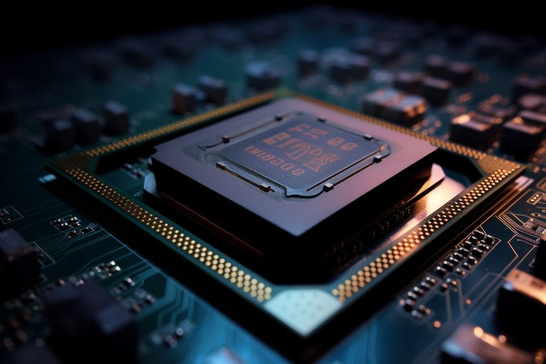

SK海力士首席执行官郭鲁正对全球存储芯片市场作出长周期乐观判断，为半导体行业的持续景气提供了有力背书。

当地时间8月27日，郭鲁正在美国印第安纳州西拉法叶市普渡大学举行的AI存储先进封装生产基地奠基仪式后召开记者会，明确表示存储芯片供应短缺局面将延续至2030年底。他同时指出，即便届时出现下行周期，需求也不会急剧萎缩，"2030年之后也无需担忧"。

郭鲁正强调，目前市场尚未出现下行的明显信号，且AI驱动的需求结构正从标准化产品向定制化产品转型，这将从根本上改变过去供需失衡的周期性规律，使未来即便出现下行，供给过剩的冲击也将远小于历史水平。

短缺周期或延续至2030年底

郭鲁正在被问及存储供应短缺将持续多久时表示，"没有人能确切知道短缺期会持续多长时间，但目前看不到下行的明显信号，我们预计短缺局面将持续到2030年底。"

这是SK海力士高层迄今对本轮存储上行周期作出的最为明确的时间预判。郭鲁正同时表示，"下一次下行将与过去数十年我们所经历的有所不同"，暗示本轮周期的结构性支撑较以往更为稳固。

AI定制化需求重塑供需结构

郭鲁正将上述判断的核心逻辑归结于AI需求的结构性变化。他指出，AI业务模式正推动存储产品从100%标准化产品向部分定制化乃至完全定制化产品转型。

这意味着供给将更紧密地与具体需求挂钩，从而在结构上压缩供给过剩的空间。郭鲁正表示，"即便下行到来，需求也不会急剧减少，更可能是有所放缓或维持在计划水平"，并以此为由表示对2030年之后的市场前景同样不感到忧虑。

在被问及是否有在美国进一步扩大半导体生产设施投资的计划时，郭鲁正表示，"只要有地方能提供充足的电力、资金和补贴等资源，我们对任何地点都持开放态度。"

风险提示及免责条款

市场有风险，投资需谨慎。本文不构成个人投资建议，也未考虑到个别用户特殊的投资目标、财务状况或需要。用户应考虑本文中的任何意见、观点或结论是否符合其特定状况。据此投资，责任自负。

原文地址(需上网): `https://wallstreetcn.com/articles/3780520`

读完再打点: `uv run main.py feedback --edition 2026-08-28-am --n 6 --label 1` 有用, `--label -1` 无用。没读不要标。

---

## F07 · Salesforce大涨23%引爆SaaS反弹，华尔街重新押注传统软件

> 总分 0.38 · sim 0.58 · len 1.00 · kw 0.50 · hot 0.04 · 批判 6/10
> 挑战了: 触及:然而 — 有反例/前提/边界,启发式加分
> 今天 09:46

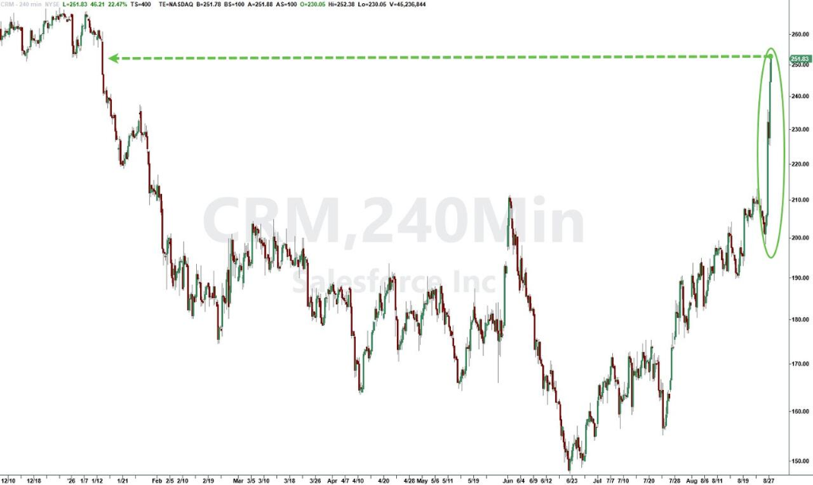
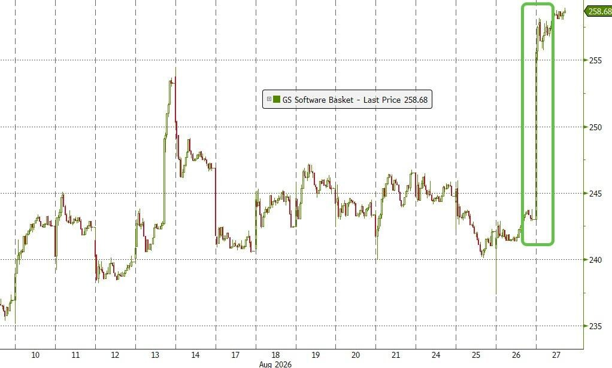

SaaS股票集体反弹，Salesforce单日大涨23%，华尔街重燃软件股热情。

Salesforce发布好于预期的季度业绩后，软件股周四迎来大幅反弹，此前被AI替代威胁论压制的SaaS板块出现明显的情绪逆转。

Salesforce股价单日暴涨23%，一举将年内跌幅收窄至约4%。而在此之前，该股较2025年底收盘价一度下跌43%。

（Salesforce股价大涨，年内跌幅收窄至约4%）

ServiceNow、Figma、Asana等遭重创的软件股亦随之回升。网络安全板块同步走强，CrowdStrike上涨20.5%，Okta劲升29%，两家公司均于同日发布财报。

（软件板块周四大幅走强）

KeyBanc分析师Jackson Ader表示：

我们都逐渐意识到，这个行业将比预期更具韧性……我们不会消失……这就是为什么Salesforce拿出一份还不错但并不亮眼的成绩单，却引发如此巨大的市场反应。

业绩并不亮眼，但市场选择向前看

Salesforce的财报数据本身并不算突出。

华尔街见闻提及，截至7月的季度，公司营收增速为11%，较第一季度放缓2个百分点；若剔除去年11月收购Informatica带来的并表贡献，自然增长率仅为6.4%。

然而，Salesforce给出了下半年自然增长将小幅提速的预期，并据此上调了全年营收指引。市场对这一信号的反应远超数据本身所呈现的力度。

分析师认为，这正是此轮反弹的逻辑所在：投资者此前因担忧AI颠覆传统软件模式而大幅抛售相关股票，反应明显过度。软件公司的增长仍在持续，即便增速有所回落，但行业并未如悲观预期所描述的那般走向瓦解。

科技并购潮持续涌现

Salesforce财报引发的市场关注，并非近期科技行业的唯一焦点。

据The Information报道，英伟达已同意以129亿美元收购开源AI平台Hugging Face，成为近18个月来科技行业并购潮中的最新案例。

这一并购浪潮还包括：Stripe据报以70亿美元收购OpenRouter、SpaceX收购Cursor、Salesforce收购Informatica，以及谷歌收购Wiz。

如今的监管环境已截然不同。科技公司显然意识到，当前宽松的反垄断态势窗口期有限，预计还有约两年时间，这也在相当程度上推动了当前的并购提速。

风险提示及免责条款

市场有风险，投资需谨慎。本文不构成个人投资建议，也未考虑到个别用户特殊的投资目标、财务状况或需要。用户应考虑本文中的任何意见、观点或结论是否符合其特定状况。据此投资，责任自负。

**相关报道(已折叠):** 2028财年冲刺10000亿美元收入？英伟达点燃华尔街新预期；“当红研究机构”Citrini：“美国财政部-美联储”将达成新协议，几个月后点燃；大涨超8%，市值飙升4400亿美元！英伟达打破“财报日诅咒”，拯救科技股；OpenAI、Anthropic呼吁加强网络防御：AI能力提升加剧黑客攻击风险；8月28日会员早报：特朗普将安大略湖更名为“美国湖” 小麦价格创三年新高

原文地址(需上网): `https://wallstreetcn.com/articles/3780518`

读完再打点: `uv run main.py feedback --edition 2026-08-28-am --n 7 --label 1` 有用, `--label -1` 无用。没读不要标。

---

## F08 · “AI央行”or“资产负债表即服务”质疑甚嚣尘上？英伟达叫停“收入分享换融资”模式

> 总分 0.38 · sim 0.45 · len 0.79 · kw 0.81 · hot 0.04 · 批判 7/10
> 挑战了: 触及:然而 — 有反例/前提/边界,启发式加分
> 今天 08:34

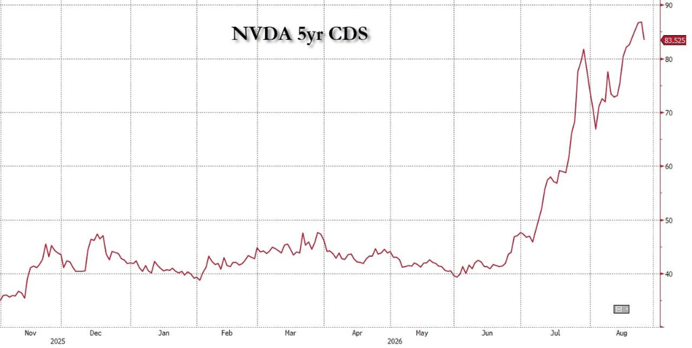
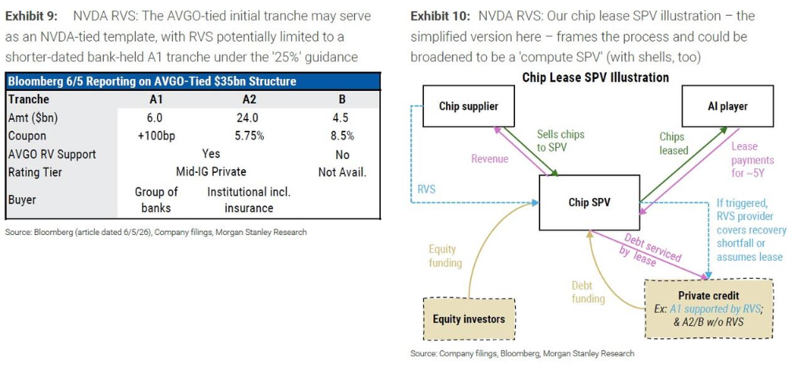
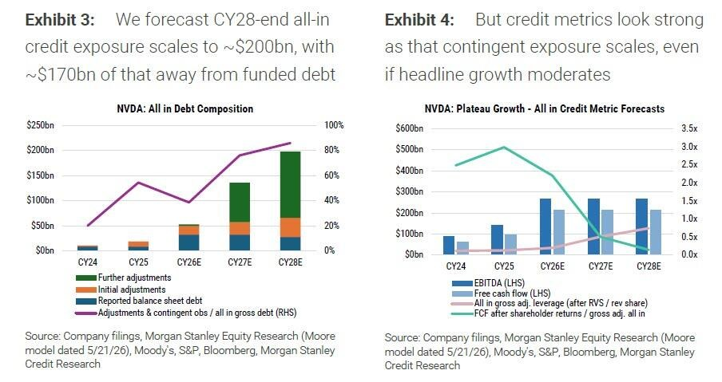

英伟达正在为其雄心勃勃的AI生态融资布局付出代价。这家全球市值最高的公司在宣布"AI算力合作伙伴计划"不足两个月后便悄然叫停部分交易，与此同时，其资产负债表上高达5305亿美元的表外承诺与担保规模首度曝光，令信用市场投资者的神经愈发紧绷。

据华尔街日报8月27日报道，知情人士透露，英伟达上周已暂停该收入分享计划下的部分协议，原因之一是公司内部员工担忧该模式可能引发反垄断审查，并对芯片巨头向客户施加经营控制的边界存在顾虑。

与此同时，摩根士丹利首次启动对英伟达信用的覆盖研究，给出中性评级，警告该公司正将资产负债表转化为战略性AI融资工具——即所谓"资产负债表即服务"（Balance-Sheet-as-a-Service）——并由此引入新的尾部风险。

分析认为，上述两件事叠加发生，使华尔街对英伟达"循环融资"模式的质疑骤然升温。英伟达信用违约互换（CDS）报价已接近历史高位，收于83个基点，较历史均值翻逾一倍。

摩根士丹利信用分析师Lindsay Taylor直言，英伟达超过5000亿美元的合作伙伴关系仍处于意向书阶段，收入分享与信用支持框架披露有限，尾部风险"过于早期、不透明且规模庞大"。

叫停背后：反垄断顾虑与控制权争议

据《华尔街日报》报道，英伟达于今年7月宣布推出"AI算力合作伙伴计划"（AI Compute Partnership），核心逻辑是为中小型云服务商解决融资难题。

报道称，建设AI云基础设施需要提前投入数十亿美元购买英伟达GPU及数据中心，而这些云服务商往往在尚未签下足够客户合同的情况下便需要融资。英伟达的方案是：承诺在云服务商找不到其他客户时，自行租用其GPU算力，从而为云服务商提供有保障的收入来源，进而帮助其获得建设基础设施所需的贷款。

该计划同时为英伟达开辟了两条盈利路径：一是销售芯片，二是从客户出租芯片所产生的收入中抽取分成。据报道，知情人士透露，双方会设定一个基础小时费率以覆盖云服务商的成本（包括芯片折旧、数据中心运营及人员开支），在此基础上，英伟达将获得超出门槛部分收入的50%。首批参与该计划的云服务商为Sharon AI和Firmus Technologies。

然而，该计划在推出后数周内便引发摩擦。报道指出，知情人士称，英伟达要求云服务商只能将芯片租给经其审批的客户，并倾向于将算力分散给多家小型AI公司，而非租给单一大客户。部分云服务商对此强烈抵制，认为自主选择客户是基本商业权利。英伟达内部员工随后向现有及潜在客户表达了对反垄断风险的担忧，认为芯片巨头对客户经营决策的干预程度存在敏感性。

英伟达上周正式暂停了该计划下的部分交易，距其宣布不足两个月。英伟达发言人表示，"7月推出的新商业模式仍然有效，并因需求旺盛而持续演进"，并未否认暂停一事。据报道，知情人士称，英伟达未来可能对该计划进行改版，或将其并入其他项目。

表外承诺首度曝光：5305亿美元的数字震动市场

就在叫停消息传出的同一周，英伟达在最新的季度财报文件中首次披露了其表外承诺的具体规模，数字之大令市场侧目。

据澳大利亚金融评论报（AFR或FR）测算，英伟达的承诺涵盖多个层面：

向供应商购买存储容量的承诺从1190亿美元在三个月内跃升至2790亿美元；向Firmus、Iren等新兴云服务商提供的土地、电力及数据中心容量支持承诺达560亿美元；向其他数据中心开发商提供的贷款担保达1085亿美元。

各项合计，英伟达披露的表外远期承诺与担保总额高达5305亿美元，时间跨度延伸至2032年以后。

英伟达首席财务官Colette Kress在财报电话会议上正面回应了外界的循环融资质疑：

"我们意识到这种支持的规模，我们知道有人会称之为循环融资。我们的看法不同。我们正在经历一次重大的计算平台转变，这是人类历史上最重要的技术之一，这些都是千载难逢的公司。"

她同时预测，这一新收入来源在中长期内可为英伟达带来数十亿美元的收益。

然而，财报数据同时揭示了另一层隐忧：第二季度净利润为560亿美元，而经营性现金流仅为240亿美元，两者之间存在360亿美元的缺口。

这一差距主要源于应收账款的急剧膨胀——截至报告期末，英伟达应收账款余额达631亿美元，较1月底的385亿美元大幅攀升。英伟达在文件中坦承，"与部分投资级客户的融资安排，包括大型多季度协议下的延长付款条款，将继续影响经营性现金流的时间节奏"。

值得注意的是，仅五家公司（推测为微软、亚马逊、Alphabet、Meta及甲骨文）便占据了上述应收账款余额的70%，集中度风险不容忽视。

摩根士丹利解剖"尾部风险"：三大敞口逐一拆解

摩根士丹利在其首份英伟达信用覆盖报告中，构建了一套超越传统杠杆指标的分析框架，将英伟达的信用敞口拆解为三大类别，并预测至2028年底，英伟达的全口径信用敞口将达到约2000亿美元，其中约1700亿美元来自各类调整项与或有义务。

第一类：租约负债与担保敞口。

英伟达已披露的未开始履行的租约义务达324亿美元，期限3至20年，预计将于2027财年第二季度至2033财年间陆续启动。摩根士丹利估算，这些承诺最终可能新增约208亿美元的租约负债。

此外，英伟达还披露了35亿美元的合作伙伴设施租约担保最大敞口，并为俄亥俄州PORTS-Pike科技园区提供了涵盖约4.25吉瓦IT负荷的剩余价值担保（RVG）。

标普预计，随着相关建筑于2028至2030年间陆续投入使用，英伟达的债务调整额将从2028年的42亿美元逐步攀升至2031至2032年的约377亿美元。

第二类：5000亿美元合作伙伴计划下的剩余价值支持。

今年8月，英伟达宣布与Apollo、贝莱德、黑石、布鲁克菲尔德、高盛及KKR建立合作，计划动员逾5000亿美元第三方资本用于AI基础设施建设。英伟达表示，在部分项目中，其可能提供最高25%的剩余价值支持机制。

摩根士丹利建立了一套假设驱动的多期模型，将该框架扩展至约500亿美元规模的15个融资批次，估算英伟达的或有义务峰值约为900亿美元，出现在2028年底后不久。

该行指出，这5000亿美元合作伙伴计划目前仍处于意向书阶段，融资规模、节奏及担保结构均存在高度不确定性，且随着敞口通过特殊目的载体（SPV）及私募结构转移，未来披露可能十分有限。

第三类：收入分享与未售算力兜底安排。摩根士丹利认为，这一类别的潜在影响可能最为深远，也最难追踪。该行对5吉瓦受支持算力进行情景建模，估算至2028年底的或有义务约为810亿美元（税后约640亿美元）。

最直接的先例是英伟达对CoreWeave的63亿美元承诺——承诺在CoreWeave无法找到其他客户时购买其剩余云算力。标普已将此类未售算力兜底安排纳入债务调整范畴，处理方式与租约担保类似。

信用市场的分歧：基本面稳健，但尾部风险定价不足

摩根士丹利的分析呈现出一种内在张力：基本面数据依然强劲，但尾部风险的不透明性令其无法给出买入建议。

从基本面看，即便纳入全部1700亿美元的调整与或有义务，英伟达的资产负债表依然极为稳健。摩根士丹利预测，至2029财年/2028日历年，英伟达净现金（扣除资产负债表债务后）可达约5200亿美元，或在纳入全口径调整后仍有约3500亿美元。全口径杠杆率仅约0.4倍，股东回报后自由现金流超过全口径债务的100%。即便EBITDA和自由现金流在2027财年预测水平上停滞不前，上述指标在2029财年仍分别维持在约0.7倍和约15%的合理水平。

然而，信用市场的定价已悄然发生变化。英伟达5年期CDS报价约84至89个基点，较同评级的Alphabet和亚马逊宽出约25个基点，而英伟达2036年到期债券的利差仅比评级更低的IBM和AT&T债券收窄10至20个基点。

Vantage Point Asset Management首席投资官Nick Ferres指出，如何解读英伟达的业绩，取决于投资者是股票投资者还是信用投资者——对于后者而言，循环融资安排带来的额外风险层始终挥之不去。

摩根士丹利建议投资者在现金债券和CDS上均保持观望，并表示若CDS突破100个基点、现金债券利差接近AT&T水平，才会考虑介入。该行同时警告，CDS可能因贷款方对冲需求和主题性仓位而相对现金债券表现偏弱。

英伟达的辩护：这次真的不同？

面对外界将其与互联网泡沫时期光纤巨头"借钱给客户买自家产品"相提并论的质疑，英伟达管理层选择正面迎战。

Colette Kress在财报电话会议上援引了超大规模云服务商的资本开支预测为自己背书：预计2026年五大超大规模云服务商的资本投入将接近8000亿美元，2027年将达1.3万亿美元。

英伟达首席执行官黄仁勋则从需求端论证增长的可持续性，强调AI正从人类主导转向AI智能体主导，"一个智能体所需的算力是人类使用时的15至100倍，所需算力规模是非凡的"。

他还罕见地提前披露了2028财年的全年业绩指引，预测收入增速高达70%，远超市场此前45%的预期共识，此举直接推动股价在连续五个季度"业绩超预期却下跌"的怪圈后终于实现反弹。

然而，金融博客ZeroHedge称，"这次不同"历来是金融史上最危险的四个字。英伟达的循环融资逻辑能否成立，最终取决于AI需求能否按照管理层描绘的轨迹持续兑现。摩根士丹利的结论或许最能代表当前信用市场的主流心态：

英伟达的基本面无懈可击，但在超过1万亿美元的GPU及XPU相关生态融资通过创新结构逐步落地之前，这张资产负债表究竟是护城河还是隐患，答案尚需时间检验。

风险提示及免责条款

市场有风险，投资需谨慎。本文不构成个人投资建议，也未考虑到个别用户特殊的投资目标、财务状况或需要。用户应考虑本文中的任何意见、观点或结论是否符合其特定状况。据此投资，责任自负。

原文地址(需上网): `https://wallstreetcn.com/articles/3780512`

读完再打点: `uv run main.py feedback --edition 2026-08-28-am --n 8 --label 1` 有用, `--label -1` 无用。没读不要标。

---

## F09 · 7月规上工业企业利润：分化走扩

> 总分 0.33 · sim 0.31 · len 0.72 · kw 0.76 · hot 0.04 · 批判 4/10
> 挑战了: 像营销或标题党 — 命中低分特征
> 今天 10:16

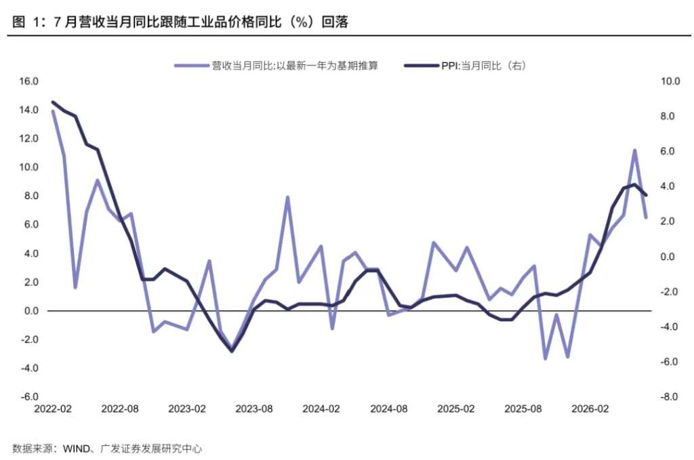
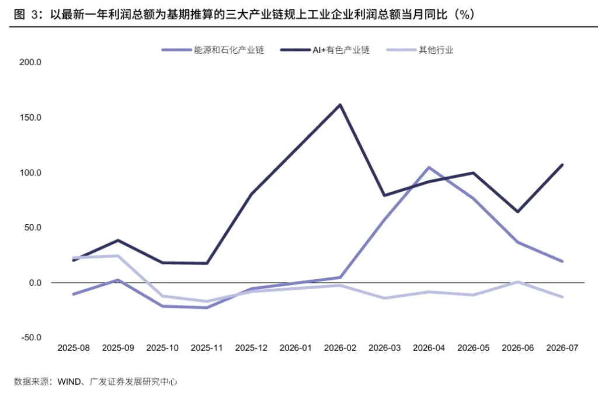
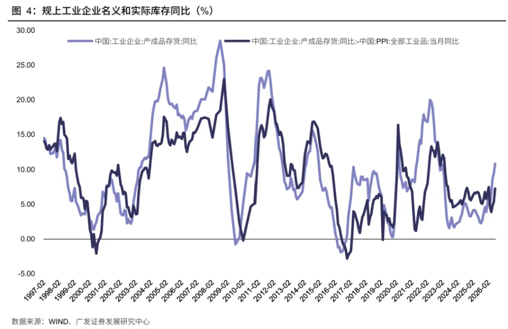

摘要

第一，7月规上工业企业营收当月同比增长6.5%，在6月创下11.2%的同比新高后放缓。生产、价格同步回调，工增同比由6月的5.3%降至4.5%，PPI同比由6月的4.1%降至3.5%。今年前7个月营收同比增长6.5%，从年度值来看仍是过去五年以来最快，这一点受益于今年PPI年度中枢的抬升。

第二，7月规上工业企业利润同比增长11.2%，自4月高点的24.7%后连续第3个月呈现放缓趋势。利润与营收走势不一致，背景之一是PPI同比虽6月见顶，利润率同比却于更早的4-5月见顶，国际油价均值4-5月见顶可能是一个原因，它带来相关行业的产成品价格和利润率于同期见顶。

第三，规上工业企业盈利的K型分化在7月有所扩大。今年前7个月，“能源和石化”、“AI+有色”利润合计同比分别为44.7%、97.4%，扣除这两部分之外的其他行业利润同比只有-7.3%。以7月边际变化看，“AI+有色”利润单月同比涨幅再度扩大至107%，重回三位数增长；“能源和石化”产业链利润当月同比下降至19.4%；其他行业利润当月同比进一步降至-13%。

第四，进一步观测细分行业数据，有四条行业线索值得关注。（1）煤炭行业未受石油价格回落影响，利润增速自年初以来呈单边改善趋势；（2）计算机通信电子行业利润累计增速结束3-6月的回调、大幅上行至105%，统计局在解读中提到“集成电路、计算机整机、计算机外围设备、工业控制计算机及系统、电子专用材料、半导体分立器件、电子电路制造、光纤、光缆、通信系统设备”是利润高增长的主要细分子行业；（3）7月仪器仪表、电气机械、专用设备、金属制品利润累计同比均较前值不同程度上升，统计局指出“导航、测绘、气象及海洋专用仪器，口腔科用设备及器具行业利润同比分别增长157.8%和74.5%”；（4）化纤、纺服、造纸、印刷、饮料茶酒利润累计同比较前值有所加快，劳动密集型消费品出口的边际好转是原因之一（我们在报告《双线与新机：2026年中观产业链中期展望》中有过提示），工业外包装需求集中释放[8]可能是原因之二。

第五，实际库存上行斜率加大。截至7月末，规上工业企业名义和实际产成品库存同比分别增长10.8%和7.3%，分别较前值加快1.3和1.9个点；由于PPI同比的回落，实际库存的累积速度明显加快。从名义库存来看，2025年9月以来一直处于补库存的周期。我们理解上半年可能存在上游商品价格触底、营收改善所带来的“主动补库”；但7月可能是“被动补库”为主，需求端（新订单）有所降温，但生产端的调整滞后，导致产成品被动积压。

第六，工业企业负债增速继续上行，关注企业应收账款回收期的反复。截至7月末，规上工业企业资产负债率58.4%，同比上行0.3个点，自年初以来同比增幅呈现小幅上行态势。负债增速单边上行是主要原因，7月末负债同比增长7.1%，自2025年末低点的4.2%持续上行。应收账款平均回收期71.9天，环比增加0.2天，同比增加0.9天，同比增幅较6月小幅增加。8月21日召开的国务院常务会议，要求“督促指导地方用好专项债券、专项再贷款等政策，打通‘连环清’链条，切实提升清欠质量、严防新增拖欠”[11]。

第七，综合来看工业企业盈利数据：（1）我们若观测规上工业企业利润同比走势与万得全A指数，2023年Q4以来走势基本一致，显示基本面定价的特征一直都成立。只有2025年Q4利润增速的调整并未带来权益市场调整，可能与当时全球叙事定价、逆周期政策定价特征均较强有关。今年6-7月利润的放缓是同期万得全A中枢调整的原因之一。（2）7月工企营收和利润增速边际回调，是同期经济数据边际放缓在企业经营端的反映；从7月底政治局会议[19]、8月17日国务院全体会议[20]精神来看，以加快财政进度为主线的小幅稳增长出现。（3）今年股票市场风格较为集中，这与企业盈利的K型分化有关。从7月企业盈利的K型特征继续有所走阔来看，基本面的收敛尚未出现，后续有待观察狭广义财政加快落地的影响。

正文

7月规上工业企业营收当月同比增长6.5%，在6月创下11.2%的同比新高后放缓。生产、价格同步回调，工增同比由6月的5.3%降至4.5%，PPI同比由6月的4.1%降至3.5%。今年前7个月营收同比增长6.5%，从年度值来看仍是过去五年以来最快，这一点受益于今年PPI年度中枢的抬升。

据万得数据（下同），今年1-7月规上工业企业营收累计同比增长6.5%，持平前值。

根据7月营收累计规模和同比推算，对应7月营收当月同比增长达到6.5%，6月为11.2%，5月同比为6.7%；统计局公布4月营收当月同比为5.7%，3月为4.4%[1]。

7月工增同比4.5%，低于前值的5.3%；PPI同比自6月高点的4.1%降至7月的3.5%。

7月规上工业企业利润同比增长11.2%，自4月高点的24.7%后连续第3个月呈现放缓趋势。利润与营收走势不一致，背景之一是PPI同比虽6月见顶，利润率同比却于更早的4-5月见顶，国际油价均值4-5月见顶可能是一个原因，它带来相关行业的产成品价格和利润率于同期见顶。

1-7月规上工业企业利润总额同比增长17.6%，较前值回调1.1个点。

7月利润当月同比增长11.2%，今年1-2月同比为15.2%，3月为15.8%、4月为24.7%、5月为21.1%、6月同比为15.1%。

利润率方面，1-7月规上工业企业营收利润率为5.66%，同比提高0.54个点[2]；1-6月利润率为5.70%，同比提高0.59个点[3]；1-5月利润率为5.56%，同比提高0.63个点[4]，1-4月营收利润率为5.43%，同比提高0.6个点[5]；1-3月营收利润率为5.11%，同比提高0.46个点[6]；1-2月营业收入利润率为4.92%，同比上升0.43个点[7]。

1-7月，规上工业企业每百元营收中的成本85.00元，同比减少0.47元；1-6月为同比减少0.55元；1-5月为同比减少0.59元；1-4月为同比减少0.55元；1-3月为同比减少0.40元；1-2月为同比减少0.24元。（同链接2-7）

1-7月，每百元营业收入中的费用为8.41元，同比减少0.09元；1-6月同比减少0.06元；1-5月同比持平；1-4月为同比增加0.01元；1-3月为同比减少0.01元；1-2月为同比增加0.02元。（同链接2-7）

规上工业企业盈利的K型分化在7月有所扩大。今年前7个月，“能源和石化”、“AI+有色”利润合计同比分别为44.7%、97.4%，扣除这两部分之外的其他行业利润同比只有-7.3%。以7月边际变化看，“AI+有色”利润单月同比涨幅再度扩大至107%，重回三位数增长；“能源和石化”产业链利润当月同比下降至19.4%；其他行业利润当月同比进一步降至-13%。

1-7月，“能源和石化产业链”（煤炭开采、油气开采、石油加工及炼焦、化工、化纤、橡塑）合计利润同比增长44.7%，2025年同比为下降21.5%；“AI+有色”（计算机通信电子、有色采选、有色冶炼）三大行业合计利润总额同比97.4%，2025年同比为增长21.9%；以规上工业企业利润总额减去前述两大线索后，其他行业1-7月利润同比下降7.3%，2025年为增长2.9%。

以7月单月增速看，“能源和石化产业链”利润同比增长19.4%，前值36.6%；“AI+有色”产业链利润同比增长107%，前值64.5%；其他行业利润同比下降13%，前值为增长0.7%。

进一步观测细分行业数据，有四条行业线索值得关注。（1）煤炭行业未受石油价格回落影响，利润增速自年初以来呈单边改善趋势；（2）计算机通信电子行业利润累计增速结束3-6月的回调、大幅上行至105%，统计局在解读中提到“集成电路、计算机整机、计算机外围设备、工业控制计算机及系统、电子专用材料、半导体分立器件、电子电路制造、光纤、光缆、通信系统设备”是利润高增长的主要细分子行业；（3）7月仪器仪表、电气机械、专用设备、金属制品利润累计同比均较前值不同程度上升，统计局指出“导航、测绘、气象及海洋专用仪器，口腔科用设备及器具行业利润同比分别增长157.8%和74.5%”；（4）化纤、纺服、造纸、印刷、饮料茶酒利润累计同比较前值有所加快，劳动密集型消费品出口的边际好转是原因之一（我们在报告《双线与新机：2026年中观产业链中期展望》中有过提示），工业外包装需求集中释放[8]可能是原因之二。

1-7月煤炭行业利润同比增长34.9%，好于前值的33.5%，累计同比自开年以来处于持续上行过程中。

1-7月计算机通信电子行业利润同比增长105%，结束3-6月的持续回调，利润增速再度扩大。

以算力芯片、存储芯片为代表的集成电路行业利润同比增长18.5倍，对全部电子行业利润增长贡献率超过八成。其他相关行业中，与计算机、服务器相关的计算机整机制造、计算机外围设备制造、工业控制计算机及系统制造行业利润分别增长3.3倍、2.5倍、1.6倍；电子器件制造和电子元件制造领域中，电子专用材料制造、半导体分立器件制造、电子电路制造行业利润分别增长226.8%、45.8%、37.1%。[9]

从行业看，电子及通信设备制造领域中，光纤制造、光缆制造、通信系统设备制造行业利润分别增长468.4%、62.6%、55.0%；医疗仪器设备及仪器仪表制造领域中，导航、测绘、气象及海洋专用仪器制造行业利润增长157.8%，口腔科用设备及器具制造行业利润增长74.5%。[10]

7月劳动密集型消费品（纺织纱线、服装、玩具、鞋靴、箱包）合计出口金额同比增长6.2%，6月为4.5%，此前3-5月同比均为负增长。

实际库存上行斜率加大。截至7月末，规上工业企业名义和实际产成品库存同比分别增长10.8%和7.3%，分别较前值加快1.3和1.9个点；由于PPI同比的回落，实际库存的累积速度明显加快。从名义库存来看，2025年9月以来一直处于补库存的周期。我们理解上半年可能存在上游商品价格触底、营收改善所带来的“主动补库”；但7月可能是“被动补库”为主，需求端（新订单）有所降温，但生产端的调整滞后，导致产成品被动积压。

截至7月末，规上工业企业产成品库存同比增长10.8%，较前值加快1.3个点。

以剔除PPI同比估算实际库存同比增长7.3%，较前值加快1.9个点，实际库存连续3个月上行。

工业企业负债增速继续上行，关注企业应收账款回收期的反复。截至7月末，规上工业企业资产负债率58.4%，同比上行0.3个点，自年初以来同比增幅呈现小幅上行态势。负债增速单边上行是主要原因，7月末负债同比增长7.1%，自2025年末低点的4.2%持续上行。应收账款平均回收期71.9天，环比增加0.2天，同比增加0.9天，同比增幅较6月小幅增加。8月21日召开的国务院常务会议，要求“督促指导地方用好专项债券、专项再贷款等政策，打通‘连环清’链条，切实提升清欠质量、严防新增拖欠”[11]。

截至7月末，规上工业企业资产负债率为58.4%，同比上升0.3个点[12]；6月为同比上升0.3个点[13]；5月为同比上行0.3个点[14]；4月同比上升0.2个点[15]；3月为同比持平[16]。

截至7月末，规上工业企业资产、负债、所有者权益同比分别为6.4%、7.1%、5.5%，分别较前值加快0.3、0.5和0.1个点。

截至7月末，规上工业企业应收账款平均回收期为71.9天，同比增加0.9天[17]；6月为同比增加0.8天[18]。

综合来看工业企业盈利数据：（1）我们若观测规上工业企业利润同比走势与万得全A指数，2023年Q4以来走势基本一致，显示基本面定价的特征一直都成立。只有2025年Q4利润增速的调整并未带来权益市场调整，可能与当时全球叙事定价、逆周期政策定价特征均较强有关。今年6-7月利润的放缓是同期万得全A中枢调整的原因之一。（2）7月工企营收和利润增速边际回调，是同期经济数据边际放缓在企业经营端的反映；从7月底政治局会议[19]、8月17日国务院全体会议[20]精神来看，以加快财政进度为主线的小幅稳增长出现。（3）今年股票市场风格较为集中，这与企业盈利的K型分化有关。从7月企业盈利的K型特征继续有所走阔来看，基本面的收敛尚未出现，后续有待观察狭广义财政加快落地的影响。

本文来源：郭磊宏观茶座

风险提示及免责条款

市场有风险，投资需谨慎。本文不构成个人投资建议，也未考虑到个别用户特殊的投资目标、财务状况或需要。用户应考虑本文中的任何意见、观点或结论是否符合其特定状况。据此投资，责任自负。

原文地址(需上网): `https://wallstreetcn.com/articles/3780511`

读完再打点: `uv run main.py feedback --edition 2026-08-28-am --n 9 --label 1` 有用, `--label -1` 无用。没读不要标。

---

## F10 · 机器人版本“MCP协议”，Claude推出“MHS协议”，便利大模型与机器人交互

> 总分 0.35 · sim 0.46 · len 0.99 · kw 0.60 · hot 0.04 · 批判 6/10
> 挑战了: 触及:边界 — 有反例/前提/边界,启发式加分
> 今天 08:53

Anthropic正将其在软件互联互通领域的成功经验复制到物理世界。这家AI初创公司推出名为"模型硬件标准"（Model Hardware Standard，MHS）的新软件规范，旨在让Claude等AI助手能够更高效地与机器人、科学仪器及制造业硬件协同工作，标志着大模型向物理世界渗透迈出关键一步。

据彭博社报道，Anthropic周四（8月27日）发表声明，以"研究预览"形式发布MHS，面向科学、机器人及制造业领域的开发者开放测试，允许其验证Claude与物理世界的交互方式，并在正式推广前建立必要的安全防护机制。目前，行业参与者可加入候补名单申请试用，Anthropic表示预览期结束后将开源该框架，但未披露具体时间表。

MHS的推出正值AI与物理世界融合的商业价值受到广泛关注之际。巴克莱此前发布的报告预测，AI驱动的机器人与自主机器市场到2035年有望成长为万亿美元级别的赛道。谷歌、OpenAI及英伟达亦在同步布局面向机器人领域的AI模型与软件。

MHS的核心逻辑：让AI"读懂"硬件

MHS的本质，是为AI助手提供一套理解硬件运作方式的标准化信息存储机制，从而替代纸质操作手册或仅存于少数专家脑中的隐性知识。

以工厂机械臂为例，硬件厂商可在MHS规范中明确定义AI操控该机械臂的安全边界，例如限制运动速度或角度，从而在赋予AI操控能力的同时规避安全风险。Anthropic技术人员Alek Kemeny表示：

"MCP为软件世界所做的，MHS将为硬件世界实现。它在科学实验室场景中尤具价值——那里往往同时运行着数十乃至数百台设备。"

对标MCP：从软件互联到硬件互联

MHS的战略逻辑与Anthropic此前推出的模型上下文协议（Model Context Protocol，MCP）一脉相承。MCP已成为AI助手与第三方软件应用交互的行业标准，使Claude及竞争对手ChatGPT得以接入Gmail、Google Calendar、Slack等主流应用。

Anthropic此次以"硬件版MCP"的定位推出MHS，试图在物理设备互联领域复制MCP的成功路径——通过制定开放标准，构建围绕Claude的硬件生态护城河，并在开源后推动该标准成为行业通行规范。

另外，Anthropic透露，MHS已与多家行业机构完成早期测试，合作方包括亚马逊云服务（AWS）、Danaher、Hugging Face及Raspberry Pi。

据报道，在Anthropic发布的宣传视频中，生物技术公司基因泰克（Genentech）的一名科学家向Claude发送了一份自行设计的实验PDF文档，Claude随即自主调用配备MHS规范的硬件设备，完成了整个实验流程的执行。

Anthropic生命科学部门合作与部署负责人Jonah Cool表示：

"很多时候，科学研究无法推进，是因为研究人员不会使用设备，或者操作难度过高。MHS能让Claude成为科学家的赋能工具，帮助他们以专业方式使用正确的设备。"

风险提示及免责条款

市场有风险，投资需谨慎。本文不构成个人投资建议，也未考虑到个别用户特殊的投资目标、财务状况或需要。用户应考虑本文中的任何意见、观点或结论是否符合其特定状况。据此投资，责任自负。

原文地址(需上网): `https://wallstreetcn.com/articles/3780516`

读完再打点: `uv run main.py feedback --edition 2026-08-28-am --n 10 --label 1` 有用, `--label -1` 无用。没读不要标。

---

## F11 · 从“利率交易”转向“美元贬值交易” ，黄金上涨的逻辑变了

> 总分 0.40 · sim 0.45 · len 0.91 · kw 0.69 · hot 0.04 · 批判 6/10
> 挑战了: 触及:然而 — 有反例/前提/边界,启发式加分
> 今天 10:22

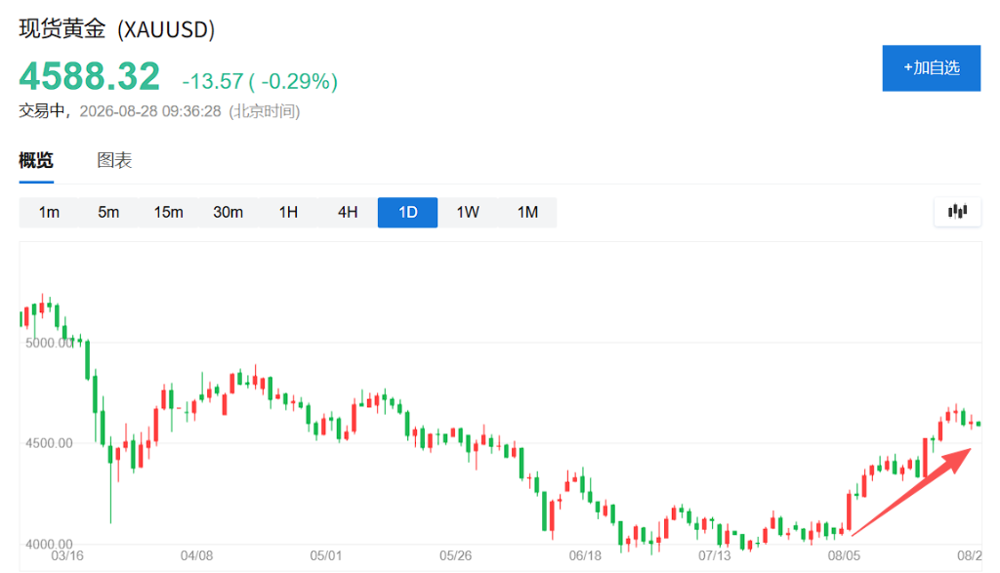
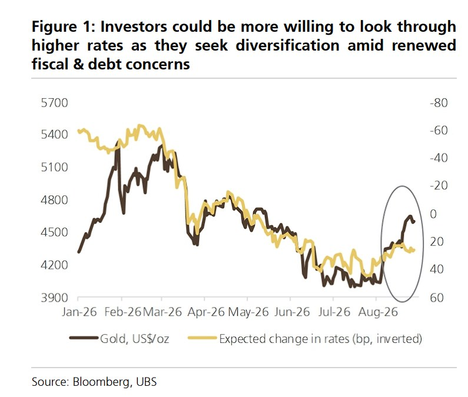
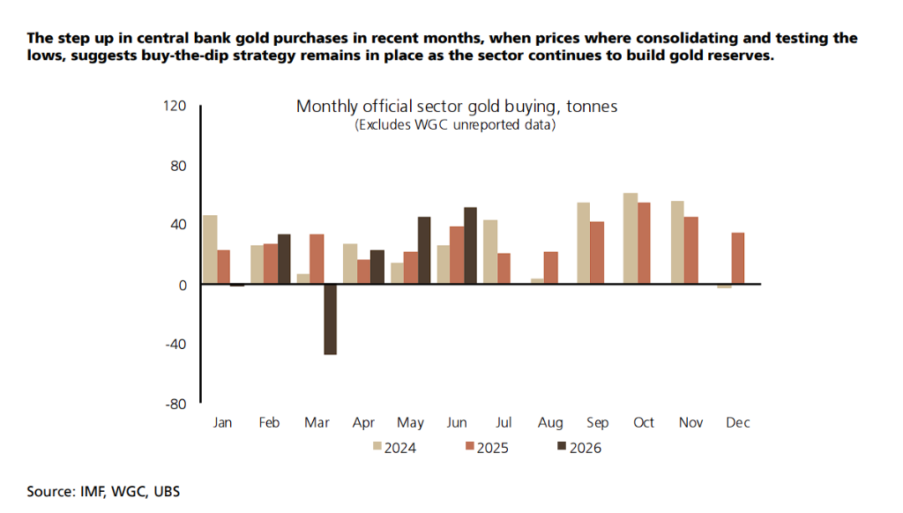

8月迄今，黄金上演了高达17%的强劲反弹。然而，瑞银认为，比涨幅更重要的是：驱动黄金这轮涨势的逻辑在中途发生了根本性转变——市场正在从传统的“利率交易”转向“美元贬值交易”（Debasement Trade）。

（现货黄金日线图）

据追风交易台消息，瑞银8月27日的贵金属研报中，将本轮黄金夏末反弹拆解为"两幕剧"：第一幕是基本面修复驱动的技术性反弹，由仓位极轻、实物需求韧性、央行购金以及美国经济数据走软共同催化；第二幕则是性质截然不同的"货币贬值交易"——美国财政部宣布将长期国债回购规模翻倍，触发市场对财政可持续性的深层担忧，黄金与利率的传统负相关关系随之松动。

该行认为，黄金定价逻辑已从"机会成本框架"（即实际利率越高、黄金越承压）向"财政信用框架"切换。即便长端实际利率维持高位，只要市场认为高利率源于财政风险而非经济强劲，黄金就可能继续上涨。

瑞银维持黄金价格看涨判断，并明确指出中长期预测的上行风险正在上升。瑞银将2026年黄金年末目标价从5000美元/盎司下调至4675美元/盎司（降幅6%），但2027年及以后预测维持不变，上行情景目标最高达6500美元/盎司。值得注意的是，该行指出，美联储鹰派立场是最主要的近期下行风险，但瑞银明确表示，若因加息预期引发回调，应视为加仓机会而非趋势逆转。

第一幕：基本面修复筑底——仓位、需求与央行构成三重支撑

报告称，在8月反弹启动之前，黄金市场的净持仓处于极度偏轻状态。持续的通胀压力令市场担忧美联储可能重启加息，投资者既不敢大举买入，也缺乏做空的底气，整体处于观望状态。尽管金价从年内高点回调约30%，中长期投资者的情绪仍然偏多，大多在等待更好的入场时机。

瑞银认为，金价多次尝试跌破4000美元/盎司均告失败，这一反复验证的过程逐步重建了市场信心，并确立了坚实的底部。底部的形成得益于超预期的需求韧性：

官方部门逢低吸纳：更重要的是，官方部门（即各国央行）在价格下跌时加速买入，为这一底部提供了实质性支撑——中国央行购金量随价格下跌而上升，呈现出明显的"逢低买入"策略。

实物需求强劲：中国黄金进口量持续高于去年同期及历史均值，反映出官方、机构和零售投资需求的共同支撑。印度方面，进口受到监管障碍的压制，但季节性需求规律正在显现，预计下半年及节庆季将带来更强的基本面支撑。

美国经济数据走软提供催化剂：8月初公布的疲软美国经济数据促使市场下调对美联储加息的预期，成为金价突破的直接导火索。初期由空头回补驱动，随后吸引新多头入场。不过，由于夏季流动性偏薄，市场参与者整体较为谨慎，获利了结较为迅速。

第二幕：叙事切换——"货币贬值交易"重返舞台

报告指出，当金价在4400美元/盎司附近企稳整固之际，第二轮上涨的导火索出现了：美国财政部宣布将长期国债回购规模翻倍。

这一举措本身规模相对于整个美债市场而言并不算大，最初设计目的也仅是流动性管理，但其释放的信号意义远超操作本身——市场将其解读为财政部有意在长端利率承压时主动介入，财政可持续性与债务可信度的讨论由此重回核心议题。

传统框架下，实际利率上升意味着持有黄金的机会成本上升，金价承压。但此次不同：利率上升的原因变了。当长端收益率的上行反映的是财政风险和主权债务信心下降，而非经济强劲，投资者便更愿意"穿越"这一机会成本，继续持有黄金。

与此同时，美元走弱形成额外顺风，进一步强化了黄金作为法币替代品的角色。无论将这一逻辑称为"去美元化"、"去法币化"还是"货币贬值对冲"，其投资组合含义是一致的：黄金可以在更广泛的宏观情景下充当多元化配置工具、硬资产和韧性来源。

上行风险正在积聚：什么情景会让瑞银更看多？

瑞银明确表示，维持黄金价格上行的基本判断，并承认中长期预测的上行风险已经上升。

最清晰的上行情景是：财政和债务问题被嵌入战略资产配置决策，推动更广泛、更持久的黄金持仓增加，使涨势在幅度和时间上均超出基准预测。以下因素将强化这一结果：

央行持续购金的证据；

亚洲实物需求的持续韧性；

美元进一步走弱。

其他看多情景包括：经济数据持续走软、美联储意外转鸽，或市场对美联储独立性的担忧重燃。

值得关注的是，目前货币政策与财政政策信号方向相悖：美联储仍专注于通胀管控，而财政部已采取行动缓解长端压力。

市场将密切解读美联储主席沃什（Kevin Warsh）在杰克逊霍尔会议上的讲话，以及财政部的后续表态。由于缺乏前瞻指引，每一个经济数据的发布都将对美联储政策预期及金价走势产生更大影响。

近期最大风险：鹰派美联储，但回调是机会

瑞银明确指出，黄金并非对鹰派美联储免疫。若今年出现加息，或美联储释放大幅提升加息概率的信号，可能通过推高实际利率和美元走强触发金价急跌。夏季流动性偏薄、8月涨幅较快，可能放大这一回调幅度。

然而，瑞银的判断是：这类回调应被视为买入机会，而非持续熊市的开端。

更关键的下行风险在于：若人工智能投资带来远超预期的经济增长，美联储将有充足空间大幅加息以压制通胀，这一情景对黄金的冲击将更为深远和持久。

总结来看，报告称，当市场开始将黄金视为对冲财政信用风险和货币贬值的工具，而非单纯的通胀对冲或利率交易，其在投资组合中的战略地位便发生了质的变化。

瑞银的研究显示，整体市场对黄金的配置仍然偏低，管理资产规模的增长为进一步多元化配置创造了空间。若财政和债务可持续性问题成为更持久的战略配置驱动因素，黄金的上涨空间将远超当前基准预测。

~~~~~~~~~~~~~~~~~~~~~~~~

以上精彩内容来自追风交易台。

更详细的解读，包括实时解读、一线研究等内容，请加入【追风交易台▪年度会员】

风险提示及免责条款

市场有风险，投资需谨慎。本文不构成个人投资建议，也未考虑到个别用户特殊的投资目标、财务状况或需要。用户应考虑本文中的任何意见、观点或结论是否符合其特定状况。据此投资，责任自负。

原文地址(需上网): `https://wallstreetcn.com/articles/3780521`

读完再打点: `uv run main.py feedback --edition 2026-08-28-am --n 11 --label 1` 有用, `--label -1` 无用。没读不要标。

---

---

# 今日一问

> 批判性思考分最高的内容。允许它和你的口味不太像。
> 生成于 2026-08-28 13:44 CST · 编号供读完打点,不需要从纸上点链接。

## F12 · “新美联储通讯社”：历史重演，当面对战争，贝森特试探“美联储与财政部的界限”

> 总分 0.33 · sim 0.42 · len 0.93 · kw 0.56 · hot 0.04 · 批判 6/10
> 挑战了: 触及:前提 — 有反例/前提/边界,启发式加分
> 今天 08:46

8月27日，《华尔街日报》刊发了一篇由资深记者、“新美联储通讯社”之称的Nick Timiraos撰写的深度报道。

报道发出的时间节点颇为微妙——正值堪萨斯城联储年度经济政策研讨会（杰克逊霍尔央行会议）召开前夕，美联储主席凯文·沃什即将登台发言，而美国财政部长贝森特的一系列动作，已成为与会央行官员场外讨论最热的话题之一。

文章发问称：贝森特究竟走了多远？ 他的债市操作、对美联储人事的关注、以及对货币政策的公开表态，是否已经越过了财政部与美联储之间那条历史划定的边界？

这条边界并非天然存在。它诞生于1951年，脱胎于一场战争，而今天，历史的回响再度响起。

一纸公告，搅动市场

上周，贝森特宣布财政部将至少翻倍回购长期国债的规模。

这一公告的时机格外引人注目——距离财政部上一次季度例行发布会仅过去两周，而此类政策调整通常在季度例会上宣布。财政部长期以来向投资者承诺，债务管理将“定期且可预测”，而非机会主义式操作。

贝森特给出的理由是：当前长期国债收益率已触及19年高位，“不能反映基本面”。他的目标，是通过扩大回购来压低长端收益率，降低政府融资成本。

Nick Timiraos认为，问题在于，这恰恰发生在美联储可能希望收紧金融条件的时刻。如果财政部的操作成功压低了长端利率，等于在美联储还没动手的情况下，提前松开了货币政策的“阀门”。

知名投资人、贝森特曾经的导师Stanley Druckenmiller本周撰文评论，直接批评这一回购计划是“价格管理”，并称其“是一个错误”。

贝森特的“多线出击”

债市回购只是贝森特近期动作的一部分。

Nick Timiraos写道，本月早些时候，他向美联储施压，要求为外国央行提供更多美元流动性，目的是支持日本在不抛售美国国债的前提下干预汇市、支撑日元——因为一旦日本大规模抛售美债，将直接推高美债收益率。

与此同时，贝森特还对亚特兰大联储行长的人选表现出兴趣。该职位自今年3月起悬空至今。

更早之前，特朗普政府还指示政府控股的房利美和房地美增加对抵押贷款支持证券的购买，以压低抵押贷款利率。

这一系列操作叠加在一起，让外界开始追问：财政部是否正在系统性地寻找各种杠杆，以绕开美联储、直接影响市场利率？

“对沃什来说是真正的麻烦”

Nick Timiraos在文中引用曾担任过去三任美联储主席顾问的乔恩·福斯特（Jon Faust）措辞写道：

贝森特的言行对沃什来说是真正的麻烦。在通胀高企之际，货币政策可能被从属于政府融资需求，这一担忧本已存在。而他偏偏选在杰克逊霍尔前夕这么做，在我看来，这相当不体贴，甚至可以说是一记耳光。

这位顾问还指出，美联储利率决策委员会（FOMC）内部本已分歧明显——上个月就有三位官员投票支持加息。如果贝森特的债市干预成功压低长端利率和借贷成本，“这肯定会推动FOMC中的大多数人进一步倾向于加息”。

对此，财政部方面予以反驳。财政部发言人表示：“在全球金融危机之前，债务管理决策完全由财政部自行决定。在贝森特部长领导下，财政部正在收回这些权力，以履行其使命——以尽可能低的长期成本为美国纳税人融资。”

贝森特本人也表示，债务回购“不会干扰货币政策”，财政部和美联储“如果资产负债表有任何变化，将会协同合作”。

沃什的两难

这场争议对美联储主席沃什而言，来得尤为棘手。

Nick Timiraos提及，沃什上任后一直强调，美联储应该“少说”未来政策走向，以便从市场价格中获得“未经过滤的真实信号”。上个月，他还专门援引上升的国债收益率，作为债券市场正在自发收紧金融条件的证据。

但现在，这些收益率的走势，可能已经掺入了财政部干预的成分，而非纯粹反映投资者对经济前景的判断。这让沃什赖以观察市场的“温度计”，变得不那么可靠了。

麻省理工学院教授、前欧洲央行官员阿塔纳西奥斯·奥尔法尼德斯（Athanasios Orphanides）则持相对温和的立场。他表示，财政部有权按其认为合适的方式管理债务，美联储的职责不是质疑这些政策，但应将其经济影响纳入利率决策的考量。

明尼阿波利斯联储主席尼尔·卡什卡利本周在电视采访中表示，他没有看到近期债市抛售令美联储工作更加困难的迹象，国债市场“运转正常”。

历史的回响：从1951年到今天

财政部与美联储之间的边界，并非一直清晰。

Nick Timiraos称，二战期间，美联储曾同意压低国债收益率，以协助政府为战争融资。这一安排直到1951年才随着一份协议的签署而终结——彼时，双方正为如何为朝鲜战争买单而争执不下。那份协议，如今被视为美联储独立性的起点。

战争还催生过另一个著名的历史场景：1965年，林登·约翰逊总统将时任美联储主席威廉·麦克切斯尼·马丁召至德克萨斯州的农场，当面训斥他在越战期间加息的决定。

沃什去年曾谈及要撰写一份“1951年协议的更新版本”。而今天，他面对的，是另一场战争引发的新一轮通胀压力，而贝森特正主导着旨在结束这场战争的经济外交。

风险提示及免责条款

市场有风险，投资需谨慎。本文不构成个人投资建议，也未考虑到个别用户特殊的投资目标、财务状况或需要。用户应考虑本文中的任何意见、观点或结论是否符合其特定状况。据此投资，责任自负。

原文地址(需上网): `https://wallstreetcn.com/articles/3780514`

读完再打点: `uv run main.py feedback --edition 2026-08-28-am --n 12 --label 1` 有用, `--label -1` 无用。没读不要标。

---

## F13 · 沃什杰克逊霍尔讲话料乏善可陈，沃勒9月表态或更具交易价值

> 总分 0.24 · sim 0.39 · len 1.00 · kw 0.56 · hot 0.04 · 批判 6/10
> 挑战了: 触及:然而 — 有反例/前提/边界,启发式加分
> 今天 05:13

周五，美联储主席凯文·沃什将在杰克逊霍尔讲话，可能将再度令寄望于明确政策信号的债券交易员失望。真正具有交易价值的时刻，或许要等到理事沃勒下周开口才会到来。

多重迹象显示，沃什将延续其上任以来惜字如金的沟通风格，不就利率走向发出明确信号。这意味着金融市场在相当程度上仍需依赖新公布的经济数据自行研判政策方向。

若讲话后美债出现抛售，市场人士认为，这更多反映的是投资者对"无前瞻指引"新框架的适应过程，而非美联储抗通胀公信力的实质性动摇。

彭博分析指出，能够为市场提供更多可操作线索的，是沃勒定于9月3日发表的讲话。届时距9月15日至16日FOMC会议前静默期开启仅剩两天，其表态的市场权重将因此大幅提升。

沃什风格已成市场痼疾，债市苦于政策方向不明

自执掌美联储以来，沃什刻意保持措辞模糊，将政策信号的解读权更多留给市场和数据，而非通过前瞻指引主动引导预期。这一风格在债市引发持续困扰。

当前，30年期美债收益率已接近近20年高位，是市场在政策不确定性下最容易遭受冲击的方向之一。

与此同时，SOFR期货定价显示，美联储9月加息的概率超过30%，短期利率预期相对稳定，而长端则更为脆弱。

沃勒曾将模糊转化为信号，本次讲话背景更为关键

如果说沃什定义了美联储当前的沟通风格，那么沃勒承担的则是政策反应函数的传达角色。

今年7月，在6月CPI数据公布前，沃勒曾将沃什的含糊立场转化为市场可以直接交易的信息。他明确表示，若核心通胀再度偏热，美联储将需要考虑近期加息。

然而此后形势发生变化。核心CPI同比增速在6月与7月均出现回落，本周三公布的PCE数据亦表现温和，令加息预期有所降温。

这使得沃勒下周讲话的分量更加突出。值得注意的是，本次活动的主题正是通胀前景与美联储政策应对，切中当前市场最核心的关切。

9月3日的讲话距FOMC会议前静默期开始仅有两天，是本轮会议前官员公开发声的最后实质性窗口。

风险提示及免责条款

市场有风险，投资需谨慎。本文不构成个人投资建议，也未考虑到个别用户特殊的投资目标、财务状况或需要。用户应考虑本文中的任何意见、观点或结论是否符合其特定状况。据此投资，责任自负。

原文地址(需上网): `https://wallstreetcn.com/articles/3780503`

读完再打点: `uv run main.py feedback --edition 2026-08-28-am --n 13 --label 1` 有用, `--label -1` 无用。没读不要标。

---

## F14 · 老黄“霸气宣言”：我们遥遥领先！

> 总分 0.35 · sim 0.30 · len 0.67 · kw 0.76 · hot 0.04 · 批判 5/10
> 挑战了: 未检测出明确假设挑战 — 中性资讯
> 今天 10:11

黄仁勋表示，尽管市场上不断出现各种XPU和AI芯片初创公司，但芯片研发门槛极高，很多项目最终都会被取消。英伟达深耕这一领域33年，拥有技术、供应链和规模优势，不仅有信心继续为合作伙伴提供最高效的AI基础设施、成为其最大供应商，而且目前市场份额仍在扩大，增长还在加速，技术领先优势也在继续拉大，因此他对所有竞争都非常从容。

原文地址(需上网): `https://wallstreetcn.com/charts/41959706`

读完再打点: `uv run main.py feedback --edition 2026-08-28-am --n 14 --label 1` 有用, `--label -1` 无用。没读不要标。

---

---

# 今日新上榜 Top 20

> 统计窗口:过去 6 小时首次上榜 · 生成于 2026-08-28 13:44 CST
> 说明:以下为平台热度排序候选,不代表重要性。

热榜本身是标题流,没有文章。有平台摘要的写在标题下面;没有的就只能看标题。

1. **西藏吉隆泥石流灾害救援最新进展** · toutiao · 今天 10:42 · 热度 4911.7万

2. **媒体：刘翔买断费推测100万-150万** · toutiao · 今天 10:42 · 热度 4444.3万

3. **全力搜寻吉隆泥石流失联人员** · toutiao · 今天 10:42 · 热度 4021.3万

4. **小天才电话手表近年多次曝出负面舆情** · toutiao · 今天 10:42 · 热度 3638.6万

5. **沙德尔在浙江温州再次登陆** · toutiao · 今天 10:42 · 热度 3292.4万

6. **媒体：演唱会上的“衣不遮体”该治了** · toutiao · 今天 10:42 · 热度 2979.1万

7. **毛主席纪念堂9月1日起恢复对外开放** · toutiao · 今天 10:42 · 热度 2695.6万

8. **“中华第一舰”退出现役** · toutiao · 今天 10:42 · 热度 2439.1万

9. **B族维生素：被忽视的“隐形营养”** · toutiao · 今天 10:42 · 热度 2207.0万

10. **直击台风登陆前两小时的浙江玉环** · toutiao · 今天 10:42 · 热度 1996.9万

11. **四川泸州近期发生山火？不实** · toutiao · 今天 10:42 · 热度 1806.9万

12. **46岁的董洁像吃防腐剂了** · toutiao · 今天 10:42 · 热度 1634.9万

13. **中方：尼泊尔一侧失联中国公民近百人** · toutiao · 今天 10:42 · 热度 1479.4万

14. **男子出轨女邻居并住其家中** · toutiao · 今天 10:42 · 热度 1338.6万

15. **用户买RTX 5080游戏本到货变5090** · toutiao · 今天 10:42 · 热度 1211.2万

16. **中国男篮83:57大胜卡塔尔男篮** · douyin · 今天 07:12 · 热度 1178.4万

17. **“沙德尔”在浙江玉环登陆** · douyin · 今天 08:12 · 热度 1111.9万

18. **运20抵达西藏驰援吉隆** · douyin · 昨天 11:26 · 热度 1110.6万

19. **秋季外套大测评** · douyin · 2026年8月26日 · 热度 1106.9万

20. **中国男篮世预赛大胜卡塔尔** · toutiao · 今天 10:42 · 热度 1095.9万

---

# 订阅更新

> 统计窗口:过去 48 小时(按刊出时间) · 生成于 2026-08-28 13:44 CST
> 订阅源 13 · 本页 13 条 · 其中 7 条有正文
> 每源最多 5 条轮询。头版/深度已选中的只留目录,不重复全文。视频不进这版。

## 订阅清单

- **Thoughts Memo 回答** · `zhihu` / `article` · weight=2.0
- **差评君 回答** · `zhihu` / `article` · weight=1.8
- **知乎日报 早报** · `zhihu` / `article` · weight=1.6
- **Bangumi 今日放送** · `bilibili` / `video` · weight=1.5
- **华尔街日报 世界新闻** · `finance` / `article` · weight=2.5
- **华尔街日报 市场** · `finance` / `article` · weight=2.3
- **华尔街日报 科技** · `finance` / `article` · weight=2.2
- **华尔街见闻 全球** · `finance` / `article` · weight=2.0
- **差评X.PIN** · `wechat_mp` / `article` · weight=2.0
- **九边** · `wechat_mp` / `article` · weight=2.0
- **人物** · `wechat_mp` / `article` · weight=2.0
- **辛庄课堂** · `wechat_mp` / `article` · weight=2.0
- **章北海的自然选择** · `wechat_mp` / `article` · weight=2.0

## 目录

1. 如何评价蒋炎岩在课件中提出“没有Token的CS学生应该立刻退学”？ · zhihu · 已上深度阅读 F05
2. 从刘小样到更多的她，我们期待怎样的女性叙事？丨对谈张越 · wechat_mp · 有正文
3. 比尔·盖茨：就算机器人更便宜，有些工作也必须留给人类 · finance · 已上头版 F02
4. 机票退改新标准或出台，工信部严禁未充分测试验证的汽车入市，千问Qwen3.8-Flash发布，OpenAI推首款芯片，这就是今天的其他大新闻！ · wechat_mp · 有正文
5. 今日知乎日报 · zhihu · 已上深度阅读 F04
6. 我的父母，晚年决定离婚 · wechat_mp · 有正文
7. 胜宏科技实控人突然将近半数间接持股转给配偶 · finance · 有正文
8. 早就退了手机圈的黑莓，在汽车圈混得风生水起。 · wechat_mp · 有正文
9. 朋友们，「狂暴」的8月终于要结束了，欢迎来到「The Moment」征集时刻！ 上个月，我们收到了超过1000份来自你们的夏日碎片，尽管天气炎热，7月的你们依然充满生命力，仿佛在集体备战奥运，有人游泳，有人打网球，有人骑行，有人桨板......大家投稿的运动种类多达16种。7月正逢四年一度的世界杯，尽管绿茵场的故事充满热血和遗憾，能和亲友一起熬夜看球也是幸福——「7月，一边暴躁，一边蓬勃」。 这个月，炎热继续，天气依然很不稳定，台风「白海豚」生命史超15天，跋涉超7000公里，造成大范围暴雨和水灾。8月也是暑假的最后一个月，不知道拥有暑假的你们都是如何度过的？这个月，我们告别了夏天，迎来了立秋，转眼2026年只剩下四个月了，点击「8月，我最难忘的瞬间」，和我们一起分享属于你的独特记忆吧，让我们抓住这快要溜走的8月。 · wechat_mp · 无正文
10. 从“利率交易”转向“美元贬值交易” ，黄金上涨的逻辑变了 · finance · 已上深度阅读 F11
11. 别说车难卖，年轻人连驾照都不考了。。。 · wechat_mp · 有正文
12. 认为“SpaceX被低估”，大摩预测“2040年收入达3.5万亿美元”，马斯克回应“不，我估计2033年就能达到” · finance · 已上头版 F01
13. 两千多的Mac mini没买，现在新款卖到7000了。。。 · wechat_mp · 有正文

---

## 如何评价蒋炎岩在课件中提出“没有Token的CS学生应该立刻退学”？

> 今天 09:33 · zhihu · Thoughts Memo

_已上深度阅读 F05，此处不重复全文。_

原文地址(需上网,纸上看不到点): `https://www.zhihu.com/question/2075868388124004913/answer/2076603306365947951`

---

## 从刘小样到更多的她，我们期待怎样的女性叙事？丨对谈张越

> 昨天 09:00 · wechat_mp · 人物

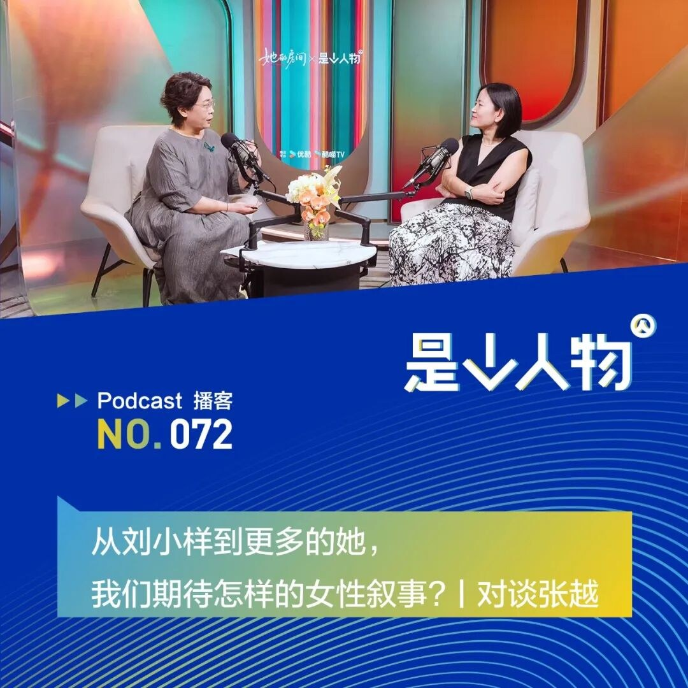

二十多年前，《半边天》曾影响一代人走出大山，走向更辽阔的世界。节目把镜头转向一个个普通女性，记录她们的命运、处境、困惑与选择。

五年前，人物《平原上的娜拉》这篇稿件重新带我们看见刘小样，重新看见那个「始终微微抬高着下巴，做出不服从的姿态，颧骨处的皮肤发红，像是正发着一场高烧的红衣女人」。

今年8月，优酷人文频道《她的房间》上线。它从张越、安小庆、刘小样三位普通女性彼此救赎的生活中生长出来，也延续着《半边天》对女性生命经验的关注。

本期播客的嘉宾，是《半边天》《她的房间》等节目的主持人张越。我们从刘小样的故事出发，聊时间如何改变一个人的自我理解，为什么不能停在命运的某一刹那，替一个人匆忙下结论；聊「宁可痛苦，不要麻木」何以穿越二十多年，至今仍然有力。与此同时，我们试着追问：当越来越多女性的故事进入公共视野，我们究竟期待怎样的讲述？它如何让一个具体的人被看见，又如何让更多人从她的故事里认出自己？

从《半边天》到《她的房间》，被打开的不只是一个个女性的房间，也是我们理解女性、理解时间和理解彼此的入口。

完整内容请点开音频播放，亦可前往各大播客平台搜索关注《是个人物》收听。

- 点击收听 -

时间轴

00:42 《她的房间》在三位普通女性互相救赎的生活中生长出来

08:02 「宁可痛苦，不要麻木」，一句话穿越时间的力量

16:01 刘小样：没有分别心地爱着这世界上的一切

26:55 是什么让一个人对同一件事的认知产生了如此大的变化？

32:48 「恨很沉重，而爱很轻」

38:47 如何面对复杂性的消失、女性意识水温的变化

46:12 最好的访谈是主持人的退场

48:26 「她的房间」一直是「半边天」的延续

51:03 我们期待怎样的女性叙事？

01:06:52 一直做时代的旁观者、发问者、记录者

01:08:23 「我从不追赶时代，但我一直在这时代之中」

01:09:31 莎士比亚的妹妹会在我们身上活过来

01:16:26 门一旦打开，就再也关不上

本期嘉宾

张越 优酷纪实谈话节目《她的房间》主持人

张寒 人物天下CEO

本期配乐

Romantic Inspiration

🎤 在小宇宙、喜马拉雅、网易云音乐、苹果播客等平台搜索关注《是个人物》，收听全部节目。

制作｜七七、也乔

亲爱的读者们，不星标《人物》公众号，不仅会收不到我们的最新推送，还会看不到我们精心挑选的封面大图！星标《人物》，不错过每一个精彩故事。希望我们像以前一样，日日相伴。

原文地址(需上网,纸上看不到点): `https://mp.weixin.qq.com/s/otJJj4xqRNUuChx4tBfiFA`

---

## 比尔·盖茨：就算机器人更便宜，有些工作也必须留给人类

> 今天 10:41 · finance · 张硕

_已上头版 F02，此处不重复全文。_

原文地址(需上网,纸上看不到点): `https://wallstreetcn.com/charts/41959707`

---

## 机票退改新标准或出台，工信部严禁未充分测试验证的汽车入市，千问Qwen3.8-Flash发布，OpenAI推首款芯片，这就是今天的其他大新闻！

> 昨天 00:00 · wechat_mp · 差评X.PIN

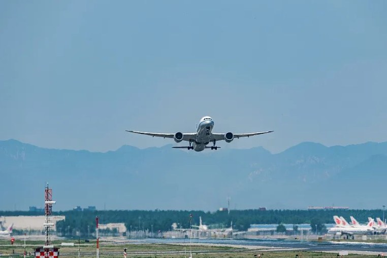

今天是 8 月 26 日

农历七月十四

托尼准备搬家了

他上周和我说

收拾出来十个箱子

今天告诉我

现在到二十个了

而且还没收拾完

。。。

下面是今天的其他大新闻

机票退改新标准计划年内出台

（ 光明网 ） 黑猫投诉平台 7 月发布的报告显示，仅今年上半年，平台就收到关于机场航空公司的投诉近 2.7 万件，其中 “ 退改费用高 ” 投诉超 1.3 万件，占比接近一半。报告提到，消费者普遍反映提前 7 天以上甚至十几天申请退票，仍被平台扣除超过 40％甚至 90％的票款作为手续费。

据了解，针对旅客关注的机票退改服务痛点，中国航协已牵头统筹推进机票退改服务升级优化工作，推出多项举措。研究出台退改标准，全面提升规则透明度。中国航协正在牵头制定机票退改专项团体标准，计划今年内正式发布实施。

标准将明确退改要求，所有售票平台、航空公司官方渠道，必须通过醒目字体、弹窗强制提示、专属标识、前置告知等方式，在旅客支付订单前主动公示退改费率、限制条件、免费退改场景，解决规则隐蔽、看不懂、不知情的问题，保障旅客知情权、选择权。

：我之前和我妈没赶上一次飞机，改票花了和买机票一样的价钱。。。

工信部：严禁未经充分测试验证的汽车进入市场

（ 观察者网 ） 8 月 26 日，工业和信息化部副部长辛国斌在国务院新闻办公室 “ 开局起步‘十五五’” 系列主题新闻发布会上回答记者提问时表示，当前新能源汽车产业发展存在一系列的问题和挑战，非理性竞争的问题仍然突出，一些 “ 激进式 ” 创新设计未经充分实验验证就装车应用。

这些问题不容忽视、不可回避。辛国斌强调，严禁未经充分测试验证的产品进入市场。工信部将加大产品生产一致性监督检查力度，切实维护好消费者的合法权益，进一步规范好产业竞争秩序。

：好！

阿里千问 Qwen3.8-Flash 发布并开源

（ 环球市场播报 ）8月26日晚，阿里发布并同步开源千问最新模型 Qwen3.8-Flash。该模型采用全新下一代架构，12总参数仅激活 60 亿（ 6B ）即可获得超越 Claude Opus4.6 的性能。

得益于架构和训练的全面革新，Qwen3.8-Flash 训练成本较 Qwen3.7-Plus 下降近 90%，推理成本同样大幅下降，每百万 Tokens 输入仅 1 元，输出 3 元。

目前，Qwen3.8-Flash-Next模型权重已在Hugging Face、魔搭社区全面开源。

：真那么狠？我品鉴品鉴。

OpenAI 推出首款芯片

（ 新浪科技 ） “ 我们造了一颗芯片，它速度很快。” 8 月 26 日，OpenAI 首席执行官山姆·奥特曼在社交媒体上官宣。

当天，OpenAI 公布首颗定制推理芯片 Jalapeño 的技术细节，Jalapeño 意为 “ 墨西哥辣椒 ”，在峰值吞吐量方面，这枚芯片的每瓦峰值性能是参照系统的 1.5 至 1.9 倍，凭借单一架构同时实现高吞吐量和低延迟，单位功耗下可处理更多 AI 任务，响应速度更快。据彭博社报道，OpenAI 芯片部门负责人 Richard Ho 在接受采访时表示，Jalapeño 的参照对象是英伟达的 GB300 芯片。

混合 Token 吞吐量峰值。在最大公开模型 Kimi K2.5 1T 上，Jalapeño 每瓦峰值性能约为参照系统的 1.5 倍。

：看这数值，还有点猛啊。

原文地址(需上网,纸上看不到点): `https://mp.weixin.qq.com/s/H6vY0DpdtR3O3rKy8qOPZw`

---

## 今日知乎日报

> 今天 08:39 · zhihu · 知乎日报

_已上深度阅读 F04，此处不重复全文。_

原文地址(需上网,纸上看不到点): `https://zhuanlan.zhihu.com/p/2076368717743649309`

---

## 我的父母，晚年决定离婚

> 昨天 09:00 · wechat_mp · 人物

如果相伴几十年的父母，在晚年选择离婚，你会怎么理解？

少年夫妻老来伴儿，这是很多人对婚姻的美好寄托。但现实中，很多人在婚姻里忍了几十年。怕影响子女、怕别人笑话，唯独没有把自己的感受放在第一位。最终，「受够了、不忍了」让他们在人生的黄昏选择了离散。余生，还是想为自己活一次。

我们访谈了几位「黄昏离散」老人的子女、婚姻家事律师，尝试记录那一代人经历的忍耐、背叛、分离，以及分离后的觉醒或困境。也让老人们的心事，被更多人看见。

以下是ta们的讲述——

文｜石润乔

编辑｜李天宇

帮妈妈离婚，为她找一条生路

讲述者：@莫小北 女 杭州 40岁 母亲66岁

两年前的愚人节，我妈终于跟我爸离婚了。她64岁，我爸62岁。

签字那天，也就是离婚冷静期的最后一天，我爸又反悔了，找理由说家里有活儿要干。我妈说，「你今天到哪里，我就跟着你」，从早晨到下午，两个人以奇怪的姿态僵持了一天。最后，我妈一分钟都不想等了，发狠说「要么你走，要么我走」，我爸才在离婚协议上签了字。

从我10岁开始，我妈就把「离婚」挂在嘴边，已经快30年了。我没结婚的时候，她说父母离异的孩子不好找对象，要等我结婚。等到我和弟弟都结婚生子了，她还是不敢。我知道她欠缺一种勇气。

从我记事起，我爸就经常打我妈，一喝酒就砸电视机、摔锅碗瓢盆。我小学的时候，有一次我爸耍酒疯一通乱摔，还拿着菜刀追我们，差点把我们砍了。好几次，我妈差点被他打死。我从小就害怕婚姻，觉得那是个不好的东西。

关键是，每次耍完酒疯，我爸都会道歉，会痛哭流涕、写保证书、主动做饭、嘘寒问暖。我妈心软，每次都会原谅。他们习惯的相处模式就是这样。先对妈妈动手，之后又求饶。这算什么？不知道你看没看过电视剧，很多女的被男的「啪」一巴掌打过去，对方哄几句就好了。我妈就是这样的。

我老家在安徽的一个村镇，没有人那么大年纪了还闹离婚。离婚对他们来说是很陌生的概念，你不觉得越穷的地方人越要面子吗？我们那边就是面子，离婚了，很怕别人说她「你怎么没老公了，没人要你了？」

所以我爸就有恃无恐，还是出去赌钱、喝酒，完全不顾忌家里人的感受。而且，他在外面还当好人，说「我对老婆怎么好，我孩子怎么不好」，让村里人都觉得我妈是过错方。

离婚真的像一场漫长的战争。之前外公留给妈妈四间平房，作为婚前财产，我爸坚持要分两间，这样他就能住在镇子上。他甚至不愿意协议离婚，一定要打官司，以为这样就能分得一半房产。三年前，我妈第一次找了律师，对方收费5000元，她没舍得花这钱。我当时说「我给你出」，她没同意，自己家的钱，同样舍不得。

这么多年，家里都没什么财产。我爸名义上在外面打工，但他很自私，抽好烟，喝好酒，还赌钱，所以也没给家里什么进账。其实是我妈一个人把我跟弟弟从小拉扯大的。她年轻时在食品厂干活，一天才睡几个小时；后来自己开食品厂，冬天加班加点赶工，每年几乎都要得一次慢性支气管炎，经常咳血。

后来，她的肺已经开始空了，伴有纤维化。西医建议我妈换肺，换了以后，排他性的东西没办法控制。

最终让妈妈下定决心的，还是一次家暴，她的肋骨被打伤，呼吸都痛。

这一次，我劝我妈，「你已经苦了这么多年，你还能活多久？如果你心态好，还能多活几年。但现在你永远活在他的世界里，他去赌钱你心烦，他喝酒你会怕，他打你你要哭，你永远都在伤心、悲痛里。被打了，被哄好了，来来回回。」

他们终于离婚了。

离完婚之后，我带她找中医，给她调理。医生搭了她的脉，「你妈妈的肺里有东西，而且身体里全是恨和怨。」建议保守治疗，让她保持心情愉悦，多调理。

其实没有办法做到马上断舍离。在婚姻刚结束时，我觉得他们彼此都会有失落感，或者有更复杂的情绪。我妈就是如此，每次跟我一打电话，就是你爸又怎么怎么样了；我爸则解脱了，开始没日没夜地玩、赌钱。我家有个地震时逃生的安全棚，里面有床和空调，我爸就赖在那里，某种意义上，他跟我妈还在同一屋檐下生活。我跟我妈说，你都离婚了，怎么还把所有的精力放在他身上？

家里的境况，其实也对我影响很大。还没离家的时候，我觉得自己太像我妈了。我对自己小气，对异性很凶；我从来不会温柔，觉得这才是正确的。我能量很低，大学毕业刚开始工作的时候，我爸和我妈都找我要钱，还要我劝架。我就觉得怎么有这么糟糕的人生？你知道吗？我都想过跳楼。

我老公是浙江人，他们这边对女孩非常好，哪怕不是独生女。我公公婆婆一辈子没分开过，甚至我公公病逝的那一天，他还在问我婆婆早饭吃了没有，中午饭吃了没有。他们的感情不热烈，但很真挚。可能我老家那一边，大男子主义蛮多的。现在，我学会跟原生家庭分手。

但我不能放弃我妈，我想改变她，至少帮她度过一段难熬的时光。我把她接到杭州来住，以前，我想带她吃点好的，她全程都冷着脸，不高兴，「为什么不在家做？出去吃这么浪费。」现在她不会了，就算剩了一桌子菜，她也开开心心的。我说，这才是你要做的，你的人生已经苦了大半辈子，如果现在想不通，那你未来还是苦。哪怕你离婚了，你还是在痛苦里挣扎。

我妈来的时候我跟她聊了很久，我说你实在太要强，家里面大大小小，吃吃喝喝，人情世故全都是你操心，唯独没有关心你自己。可惜我爸没什么担当。

她真正放下，是去年她来杭州到我家住了两个月，我带她散步、吃、玩，她觉得在我这里特别心静，也不会提到我爸了。那次再回到老家，她就叫我爸搬走了。我弟弟跟她住在一个镇上，他说，妈这次回来好像人打开了很多。我说，「是的，我天天要跟她聊天，让她也多看看大城市人的生活，她就知道自己其实太苦了。」

我看到她整个人笑容多起来了。这是给我最大的触动。我从来没有在社交媒体发什么帖子，那天就发了一条，我说，终于看见我妈快乐了。

莫小北带妈妈到新叶古村旅行，她想给妈妈拍出一张年轻的背影受访者供图

「我过得跟神仙一样」

讲述者：@梅森 男 深圳 44岁 母亲69岁

从来没想过，我的父母会以这样的方式分开。

9年前，有一天我在公司加班，妹妹打电话告诉我母亲中风了。那时候她60岁，除了「三高」和冠心病，身体状况还算稳定。好在，抢救以后，一个礼拜就出院了。直到那时，我们才知道这个家要散了。

简单来说，在母亲到深圳帮我带孩子的几个月，父亲找了一位女性临时工，给他做饭。没多久，两个人就关系暧昧。母亲回家的时候，撞见了他们，听说三个人吵了一架，父亲把母亲留在了家里。母亲中风的时候，身边没有一个人，也不会叫救护车，幸好拨通了妹妹的电话。

说实话，我不敢直接谴责父亲，或者说谴责也没用。我小时候他就打我，如果我没考到全班前两名，就被脱了裤子打，用竹条、皮带抽。而且我记得，1988年的时候，我刚6岁，父亲在湖北老家当小学老师，就出轨同校的女老师了。后来这事不了了之，他在90年代就辞职下海，带着母亲一块做木材生意去了。

父亲的学生都夸他「文化高，有本事」。母亲没念过书，是从60公里以外的村子嫁过来的。她是家里的老大，农活干得好，做人也通透。她总跟别人一顿数落父亲，但又骄傲「这人挺有魄力」，我知道，她曾经是父亲的「迷妹」。母亲中风以后，我告诉她你可以提离婚。她木讷地说，「知道了」。但她还是要跟父亲一起过，哪怕他外面有人。

过了3年，平衡还是被打破了。母亲跟我说，父亲已经把两个人共同账户里的几十万都转走了，去投资。十几年前，父亲也是这么带着她南下做生意的。这次，父亲要跟情人一起走，一个比母亲小二十多岁的女性。

我跟妹妹没法坐视不管。我们想以退为进，直接以母亲的名义起诉离婚。我想逼父亲在家庭与另外一个女人之间做选择。半年以后，法院判离，父亲带着一半财产跟情人搬走了。分财产的时候，妹妹跟母亲还闹掰了，因为母亲曾经「重男轻女」的思想。我们约定好，妹妹管父亲，我照顾母亲。

离婚以后，母亲常常跟我开玩笑说「死了算了」。这是我们老家那边的口头禅。江汉平原一带的老人，都说老了以后有三个儿子：「绳儿子、药儿子和钱儿子」。前两个是寻短见的工具，最后那个才是真正的依靠。母亲讲话很硬，很潇洒，但她老了之后，觉得不能给子女创造价值了，她就更没有活着的劲头了。

我觉得很不公平。父母结婚几十年，父亲1米76的个头儿，国字脸，外貌依然俊朗。母亲身高不到1米6，这些年的日晒、风吹，已经让她面容沧桑，变成一个矮矮胖胖的老人了。她常年担着生活的负重，最后被当作一个定时炸弹，给剔除了。她的好都被夫家吸收了，好像蜜蜂熬了半天蜜，蜜被人端走了。

母亲在我家住了三个月，觉得大城市「像是坐牢一样」，就回老家了。她还问我一句话，「你爸找了一个，那我现在能不能再找？」我说，「当然，你想找就找。」说这话时心里一阵难受：怎么感觉她就像浮萍一样，现在要一个人划船出海了。

后来，一个70多岁的老头跟我母亲走到了一起，他刚刚丧偶不久。母亲没有跟他领证，因为不想共享退休金。

电话里，母亲告诉我，「以前过得都不是人的生活，现在才觉得我像个人。」我不懂，也不信。我总跟她说，不适应就回深圳吧，不要觉得自己寄人篱下。她就说，「我过得跟神仙一样」。

关于这段关系，我听说过一件事。有一次，老头想给考上大学的孙女准备礼金，数额是两万元，遭到母亲反对。对于母亲把退休金「据为己用」的做法，他很不满。

今年5月份，她第二次中风。那时我才知道她为了省钱，没按时吃药。她打电话给我，交代银行账户的密码。我赶紧稳住她，「等孩子暑假的时候，我再回去，你给我钱」。到了8月份，她带我到镇上的银行，给我转了20万，就给自己留了1万元。

我算了一下，母亲退休金每个月2000元，意味着她至少不吃不喝连续存9年。她很有可能没有给自己买过东西，吃的、用的、一件新衣都没有。

母亲衰老得很快。2008年给她拍的一张照片里，她还发色乌黑，但是近几年以来，她几乎满头白发了。我只有一个劝母亲好好生活的理由。我跟她说，「你还需要『站岗』，每个月领退休金留给孙子，得规规矩矩吃药」。

其余能做的，就是给母亲买个智能手机，给她打视频。母亲唯一的娱乐活动，也变成了刷短视频。她从来不打牌，担心钱被别人骗走。现在，动动手指就是她的娱乐。

这个月在老家，我偷偷看过她每天刷什么视频。大数据给她推送同一类视频，标题都很像，大概是：「老公不好、婆婆不好，儿媳妇、儿子也对你不好，还是自己要对自己好一点，握紧钱袋子，守住内心」。或许，这就是她一辈子都说不出口的心里话吧。

梅森的儿子在老家玩砖头。梅森见了，觉得像是老人的「养老房」受访者供图

在她离婚后，才第一次认真关注她

讲述者：@小叶 女 北京 43岁 母亲69岁

最近5年里，母亲的变化很大。

孤身一人的她，人生目标变成了「找老伴儿」——她拜托身边的人介绍，自己去相亲网站登记、交会员费，前两年还进了直播间，不但自己直播「征婚」，还去别人的直播间寻找有缘人。

现实中，她也可以随时去相亲，去过北京、飞过厦门、赶赴过上海，都只是为了和对方见一面。像这样的异地奔赴，光是我知道的就有十几次。她想找到新的人安放感情。

我妈「被离婚」那年，已经62岁了。

现在我还记得那个「决定性」的场景：孟叔躺在床沿，不怎么说话，只是不停地唉声叹气，大概三四天，他也没怎么吃饭；我妈很愤怒，不停地骂他「没良心」「你要走就走，滚出这个家。」

离婚7年，今年她已经69岁了，经历过两段婚姻，第一段婚姻很短暂，但是有了我；第二段婚姻，持续了30年，也囊括了她人生中最大的起伏和悲喜。

我出生在东北的一个四线小城，回想我妈年轻时，经历过很多高光时刻，她最初在国营的木材厂上班，上世纪90年代初下海经商，卖服装。那时候她很有闯劲儿，自己去外地进货，装衣服的编织袋几十斤重，她肩上扛一个，手上拖一个，搬上绿皮火车，她跟我说过，车厢里人多的时候，「妈就在椅子底下睡」。

靠着年轻时的力气和对市场的观察，她开始赚钱了，1993年前后，她的服装商铺一天就能赚到1000块钱，那时候，东北很多国营工厂的职工每个月才挣三四百块钱。

后来，家里的生意越转越大，我妈开过饭店、歌舞厅，也都赚钱了。我读初中时，中午不愿下楼吃饭，她就让饭店服务员把饭菜送到我家楼下，我从6楼顺下一根很长的绳子，把饭提上来，那是小时候的美好记忆。

那时候，身边的亲戚朋友都叫她女强人、虎妞，其实我妈年轻时，是一个标准的美女，1米67的身高，大眼睛，皮肤白皙，就是嗓门儿大，一说话别人都以为她要打架。直到现在，在老年人中，她的颜值和见识也是够用的。

但「女强人」的感情生活不太顺利，第一段婚姻，在我有限的记忆里，父母总吵架，有时还动手，有一次动手，我爷爷也加入了，朝我妈打过来，那之后，她离婚了。

感情生活的真正稳定，是在第二段婚姻。又一个人来到了我的家庭，那30年，我一直叫他「孟叔」，他很宠我妈，做饭洗衣擦地，她累了，孟叔给她捏脚；想吃水果了，果盘给端到嘴边；在生意上，孟叔也给我妈打下手，做很多辅助的管理工作。这样的家庭支撑，也让我能学艺术、读大学、毕业之后落脚到北京。

家境的转折大约在2010年，我妈迷上了股票，每天跑去股票大厅看那些红红绿绿的曲线。她前后往里投了60多万元。这笔钱，到现在也没能取出来。有的大笔投入，股票的名字已经消失了。

那几年，服装生意也不好做了，我妈和孟叔去了另外一个城市，倒卖二手房，手里的积蓄越来越少。2022年，孟叔突然跟我妈说了一件事，他之前婚姻的女儿希望父亲能回归家庭：「女婿家是开工厂的，这几年赚了钱，住上了别墅。」孟叔说，只要他同意，女儿可以给他找份稳定的工作、买辆车，还给他养老……就这样，在我妈愤怒的骂声中，孟叔和她去了民政局。

我曾经觉得，我妈会和孟叔相伴终老，没想到上了年纪，却孤身一人。是我妈的暴脾气推走了孟叔，也亲手推开了她晚年的幸福——这些年，她对孟叔发过很多火，很多时候没考虑过他的感受，即便到了最后，孟叔也在艰难地做着选择，我妈没让他选。

在离婚的第二年，我发现我妈突然老了——很多事情自己反复说，但还是记不住；她的两手有点张不开了，拿东西经常拿不住，掉在地上；很多正常的交流，她经常听不懂，更多时候是坐着发呆，眼里的精气神儿没了。

我感觉到，这次离婚，是她60多年人生最大的坎儿——曾经身体健康的母亲，一下子很多病都找上来了，先天性小脑下疝脊髓空洞症、高血压、三叉神经痛、中度焦虑、轻度抑郁……整个人都塌掉了。

而更严重的是孤独。在最近5年里，她没有安放好自己和曾经的感情经历，亲相了一个又一个，原本的指望到后来都变成了摇头。问她要找什么样的，她说不出来。我眼睁睁地看着她从曾经的女强人变成了感情世界里的「乞讨者」。

最近，她又去威海了，在婚恋网站上相中了一位老人，对方是退休教师，孩子在国外，住着带院子的复式。我只知道这些，怕我妈被骗，我和老公一商量，悄悄地开车也去了威海，暗中帮着搜寻一切关于对方的信息。

从发现她变老的那一年，我也有了变化：经常给我妈打电话，听她诉说，说到手机发热；我花钱不像以前那么随意了，化妆品、孩子的玩具、家里的装饰物件、保健品……能省则省。其实心里总有种不好的预感——我妈到最后，可能也找不到自己的意中人。这句话，几次冲到嘴边，我都没有跟她说，我们不在一起生活，我改变不了她，只能从各项开支里省下点钱，算是给她做个储蓄，为她的余生兜底。

我曾评价过我妈：把一手好牌打稀烂。我怨过她，为什么那么强势，为什么她不学习，为什么她不能调整情绪，把过去都放下，后来才想到，我不能拿自己的标准去要求她。现在会觉得有点难过，这些年光顾着工作，竟然是在我妈离婚之后，才第一次认真地关注到她。

好在还不晚。前两天哄着儿子睡觉，轻轻拍着他的后背，突然想到，小的时候，我妈就是这么拍我入睡的。

图源电影《出走的决心》

晚年的女性，正在挣脱传统束缚

讲述者：张荆 女 资深婚姻家事律师，经手老人离婚案超100件

2006年，我成为一名执业律师，遇到的第一个案子就是老年人离婚。老两口生活宽裕，都领退休金。他们有两个儿子，一个女儿，分别在肿瘤医院和银行上班，待遇不错。

只是，子女们发现，妈妈长期操劳过度，而爸爸一直是甩手掌柜，吃完饭把碗一推的那种。他们和爸爸谈过，劝他改变。老头不以为然：「谁家不是这样啊？」再后来，只要一提这件事，老头就砸东西。

三个子女都来找我了，他们说得很坦诚：「张律，你就把我妈当成你的妈妈，如果你是我们，你想怎么帮她？」我那时刚执业，天真地想：难道老头宁愿离婚也不愿意谈吗？就告诉他们，咱们起诉离婚，目标只是为了改善他们的婚姻质量。还是尽量跟爸爸谈。

结果出乎意料。我印象很深，当时是夏天，法院还是平房，早上9点到法院门口以后，我拉住男方单独调解。当时我是晓之以情动之以理，但是他挺生气：「跟我离婚？还反了她了。」

由于男方坚持不配合，案件就真的走向了离婚。之后，女方到子女家里为他们看孩子，男方独自生活。半年以后，子女们告诉我，爸爸终于变化了。可能因为无人照料，他的生活质量下降了。有个细节是，男方穿的毛线衣已经脱线了一条袖子，胳膊上露出挺大一截。

后来，我办了很多老年人离婚的案子，到今天至少有100件。可以感受到，老一辈人的婚姻质量，普遍不如当代年轻人的婚姻质量高。他们那个时候，家务分工比较固定、刻板，相当多的夫妻常年不交流。很少看到类似今天年轻人的恩爱、沟通、家务分担，甚至高质量的陪伴。

相反，很多人的婚姻就是一个「忍」字，一忍就是几十年。

一个让我印象深刻的案子是——男方得了肺气肿，每年都要住院一段时间。生病以后，他突然不愿意「忍」了。他找我，就是为了和老伴离婚。原因是，他和老伴多少年来的生活理念就不一样。比如，他们的儿子30岁了，在家里啃老。老伴溺爱儿子，他坚持儿子应该承担自己的责任。生病以后，他计划自己搬到外面去住，跟老伴把财产全部分割。

老伴当然不愿意。一旦离婚，由于儿子不上班，母子俩的生活质量一定直线下降。开庭了好几次，我看到两个人分坐在法庭的对面，女方把身体斜过去，脸对着法官。男方身体僵硬，呈防御状态。法官问最基本的问题，比如：「你们现在住在一起吗？」男方只会看着我回答，避免把头转向女方。

即便如此，女方始终不同意离婚。前几次，法院都没有判离。期间，男方就去医院治疗，一旦开庭，就准时出现。我每次都能看到，女方的肢体语言明明是「恨透那个男的了」，就是不同意离婚。

我还接过一个相似的案子。一位老年女性和丈夫分居了10年，独自熬过大病、抚养孩子。10年以后，她决心起诉离婚。当时的我疑惑：这十年当中，即使生病，即使培养孩子，如果你真的想解决问题，其实不就是把对方叫回来离婚的事儿吗？为什么拖这么久？

我遇到过太多相似的案件。为什么女性如此恐惧离婚呢？我观察到，传统观念要求女性从一而终，嫁给一个男人，就要依托一辈子。至于婚姻质量好不好，家庭有没有存续的必要，不重要。

我经常在短视频里看到这样的桥段：有些女性撒泼打滚，宁死也不离婚，大家都去谴责她：「竟然撒泼耍赖到这种地步了。」事实并非如此。跟很多老年女性聊天的时候，可以看到她们年轻的时候也有理想、有抱负、人长得也好。只是在多年婚姻的磨损中，她们被传统的观念束缚着。年纪大了，仍然在婚姻的困局里。

同时代的男性，不怎么受约束。那位得肺病的老先生，没有外遇，只是不认同老伴的价值观，哪怕一个人住，也要过自己的生活。在追求婚姻自由和婚姻质量这方面，男性勇敢得多。

这种性别的差异，在语言上也体现得非常明显。很少有男方在离婚以后说「我没有家了」，而是说「我不要她了，我把她从这个家里赶出去了」。女方不同，哪怕是提出离婚的女性，也会感叹「我没有家了」。甚至，有的女性还会来一句「他在外面胡搞，那个女的也别想进老孙家的祖坟」。

我记得，一位经常直播的知名女企业家，经常提到「我们老X（前夫姓）家」。我想，他们都离婚多少年了。她在经济上早就独立了，但是精神上还需要一个依靠。

近几年，选择离婚的老年人，数量应该是增长了，但是具体数字还没有统计。我更明显的感触是，主动提出离婚的老年女性增加了，很多女性在子女的陪伴下来找我，她们大都来自普通的家庭。但有钱的家庭中，还是男性主动提离婚的情况多。

上个星期，我刚刚接待了一对母子。女方是一位知识分子，几十年前考入了重点大学的英语系。她的丈夫也很优秀，在体制内任重要职位。只是，丈夫常年在国外出差，她不仅要工作，还要一个人带孩子。这么些年，她都咬牙挺过来了，无怨无悔地付出。只是，丈夫不认为她承担了巨大压力。当男方的父母指责女方时，他也自然地拿出了「家规」去训女方。

我和女方聊了很久，关于多年来不受尊重，被打压、被否定的经历，能够听出她的隐忍与压抑。她的儿子今年24岁，本来想挽回父母的婚姻。那天，他一直在旁边听着，最后哭了。他说，「妈妈，这些都是我第一次听到，我去做爸爸的工作」。我起初建议女方给男方一些时间，如果无法改变，再提离婚也来得及。她坚决地告诉我，「给时间不是为了等对方变好。他变不变好，在我心里已经没关系了。我只是为了给儿子接受父母离婚的时间」。

我宽慰她，「你看，这些年你对婚姻的付出还是有意义的。儿子没有受到影响，说明你没有把怨气传递给他。」

上周的最后一天，我收到一条消息，女方告诉我已经办理完离婚手续。儿子和一位共同的朋友，曾经跟男方深度沟通。对方态度好转，表明自己想通了，还写了一封道歉信给她。

只是，信里流淌着自我感动。男方的隐形逻辑是：你大概是病了，等你把精神状态调节好，再来跟我谈。有一句话我觉得特别搞笑，男方说，「当某某的夫人，你也很有荣誉感吧。」

我又一次体会到，很多人的婚姻，是无法叙述的困境。很多情况不是我们外人所看到的，不是原谅ta、再给ta机会的问题。根本不是那样。

图源电影《我，许可》

亲爱的读者们，不星标《人物》公众号，不仅会收不到我们的最新推送，还会看不到我们精心挑选的封面大图！星标《人物》，不错过每一个精彩故事。希望我们像以前一样，日日相伴。

原文地址(需上网,纸上看不到点): `https://mp.weixin.qq.com/s/122zYVsm57U5Tts5Jrhllg`

---

## 胜宏科技实控人突然将近半数间接持股转给配偶

> 今天 10:25 · finance · 石惠

PCB龙头胜宏科技早间公告，公司于今日收到控股股东胜华欣业及其一致行动人香港胜宏的上层股东宏大投资的通知，陈涛先生将其持有的胜华欣业的39%的股权，以及持有的宏大投资的35%的股权转让给其配偶刘春兰女士，并就本次股权结构调整签署了相关股权转让协议。本次股权结构调整后，陈涛将持有胜华欣业的51%股权，其配偶刘春兰将持有胜华欣业的49%股权；陈涛将持有宏大投资的35%股权，其配偶刘春兰将持有宏大投资的35%股权。

同时，公司实控人陈涛与其配偶刘春兰共同签署《一致行动协议》，约定刘春兰就其所持胜宏科技的股份（包括直接和间接持有的股份）与陈涛保持一致行动，并按照陈涛的意见行使表决权。

本次股权结构调整系实际控制人家族内部的股权结构调整行为，不涉及控股股东及其一致行动人所持公司股份的变动，不触及要约收购，不会导致公司控股股东、实际控制人发生变化。

原文地址(需上网,纸上看不到点): `https://wallstreetcn.com/livenews/3156449`

---

## 早就退了手机圈的黑莓，在汽车圈混得风生水起。

> 昨天 00:00 · wechat_mp · 差评X.PIN

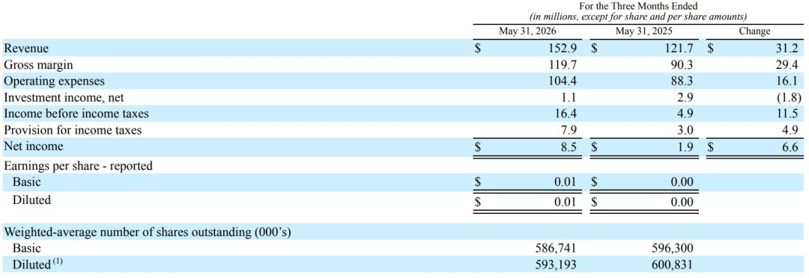
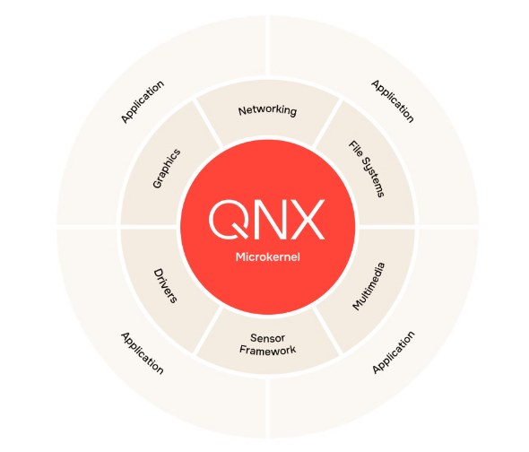

谁能想到，早就不做手机的黑莓，现在竟然在汽车上混得风生水起。

对，就是那个和诺基亚同时代，当年也是火遍大街小巷的黑莓手机。

智能手机来了后，黑莓被苹果、安卓手机们按在地上摩擦，在2016年就彻底放弃手机业务了。本来大家以为这公司死差不多了吧，可是人家非但没挂掉，现在还活得越来越好。

黑莓在2027财年一季度（2026年3月-2026年5月）的财报显示，公司总营收总营收1.529亿美元，相比去年同期的1.217亿美元，涨了26%，高于此前预估。

利润更是大涨。营业利润从去年同期的200万美元涨到1530万美元，净利润从190万美元涨到850万美元，涨幅高达347%。

而且这是黑莓时隔9年，第一次在Q1实现现金流转正。

由此可见，哥们现在状态真不错啊。黑莓还专门用了一个数据来展示自己业务有多好。

说是软件行业有个40法则：营收增长率和利润率加起来，如果≥40，就代表这块业务能兼顾盈利和增长，非常健康。而黑莓现在两大主营业务QNX和安全通信，本季度同时达标。

显然，黑莓已经脱胎换骨，而它的成功转型，就离不开这个QNX业务。

QNX诞生于上世纪80年代，最开始叫做QUNIX，是一种类UNIX实时操作系统，就和咱们更熟悉的Linux差不多是一类东西。

其实早在1999年，QNX就已经开始在汽车上应用了。到了2008年，包括宝马、戴姆勒、福特等主流车企，都有和QNX合作。

在2010年，黑莓把开发QNX的这家公司买了过来，本来是想拿来做手机操作系统的。他们还出过一款平板叫PlayBook，就用了基于QNX开发的平板系统。

但后面大伙儿也知道，它手里这东西，根本就打不过隔壁的iOS和安卓。

后面黑莓在手机上节节败退后，就还是把QNX转回到汽车市场了。而黑莓依靠原来做手机积累的信息加密、通信安全技术，转变成了一家网络安全公司。

这个车上的QNX，和我们常说的车机系统还不是一回事，而是导航、语音助手这些功能下面更底层的软件。它是直接运行在芯片上，负责调度程序、分配内存、管理硬件的实时操作系统。

这个“实时”能力很关键，比如车机导航稍微卡一下，顶多让人骂娘，但要是仪表、智驾这些慢了，问题就大了。

因此，QNX这类系统，就是要能保证汽车上的任务，能在规定时间完成。

而QNX的另一大特点，也是黑莓擅长的高安全。

汽车标准ISO 26262里规定了四种安全等级：ASIL—A、B、C、D，从低到高。不同零件需要的安全等级不一样，比如后大灯达到ASIL A就行，而安全气囊必须ASIL D。

QNX基于微内核，就是把操作系统分成若干模块，不同模块负责不同服务进程，相互隔离，天然就安全。而且它这套发平台和各种工具链，都通过了ASIL D认证。

这就相当于它作为供应商，已经把安全的底子给打好。那车企再拿着QNX这一整工具来开发，即便不是说软件先天就有ASIL D标准，至少你去做安全认证，人家看你底层系统都过关，那认证起来也会容易些。

再加上QNX在这一块的布局也确实算早，赶在新能源大爆发之前就已经铺好路子。

而且黑莓做的底层系统，是很有“粘性”的生意。因为新车型一旦开发出来，如果想换底层系统，需要重新适配芯片、重写软件，还要再走安全验证，麻烦事儿太多，车企一般不会没事给自己找这个罪受。

所以这一块的业务也是源源不断。黑莓给的数据是，全球前25家电动车企，有24家都在用QNX。包括直接和奔驰、沃尔沃这些车企合作，也包括和英伟达、德赛西威这样的一级供应商整合出产品后，再供给主机厂。

不过脖子哥倒想知道到底是哪家没用啊？

当然，这玩意儿作为软件开发的地基，其实不止在汽车上，在医疗设备、航天、轨道交通等领域也都能派上用场。

比如医疗领域里，像是呼吸机、监护仪和手术机器人等等，都需要软件。QNX就是提供一个基础的底层平台，设备厂商再在这个平台上，去开发对应的软件。

整个加起来，QNX这一块的收入，去年已经占到黑莓整个公司的48.8%。一季度发了财报后，管理层还把这一块的收入预期上调了一波。

那黑莓的另一块业务，就是看家本领通信安全了，收入占比也在48%上下，和QNX各占半壁江山。

不过这一块和咱消费者关系不大，它主要面向的是政府部门、官方机构这些，对通信有非常高加密需求的组织。

毕竟当年奥巴马都手握黑莓，祖传手艺了属于是。

而且这一部分算是一直相对稳定，主要就靠政府大单养着，咱就不展开了。

总之，黑莓这公司的故事也挺神奇。

你说当年它在手机行业被打得满地找牙，是动作慢也好，视野短也罢。

结果哥们转头去做了汽车，反正是走在了行业前沿，某种程度上也是当上回领头羊。

当然，时代会一直变下去。软件定义汽车的大潮下，很多车企这几年也开始陆续搞更底层的系统，比如蔚来SkyOS，这也是在和黑莓这样的底层系统供应商做竞争了。

那黑莓这块蛋糕能不能一直爽吃，咱就慢慢看吧。

撰文：白日梦

编辑：面线 & 脖子右拧

美编：素描

图片、资料来源：

黑莓官网

QNX Takes Pole Position in Automotive Infotainment and Telematics Market

原文地址(需上网,纸上看不到点): `https://mp.weixin.qq.com/s/MdKb0qCYzUjrno982Kvqmg`

---

## 朋友们，「狂暴」的8月终于要结束了，欢迎来到「The Moment」征集时刻！ 上个月，我们收到了超过1000份来自你们的夏日碎片，尽管天气炎热，7月的你们依然充满生命力，仿佛在集体备战奥运，有人游泳，有人打网球，有人骑行，有人桨板......大家投稿的运动种类多达16种。7月正逢四年一度的世界杯，尽管绿茵场的故事充满热血和遗憾，能和亲友一起熬夜看球也是幸福——「7月，一边暴躁，一边蓬勃」。 这个月，炎热继续，天气依然很不稳定，台风「白海豚」生命史超15天，跋涉超7000公里，造成大范围暴雨和水灾。8月也是暑假的最后一个月，不知道拥有暑假的你们都是如何度过的？这个月，我们告别了夏天，迎来了立秋，转眼2026年只剩下四个月了，点击「8月，我最难忘的瞬间」，和我们一起分享属于你的独特记忆吧，让我们抓住这快要溜走的8月。

> 2026年8月26日 · wechat_mp · 人物

_库里没有正文。热榜/视频常如此;文章则多半是抽取失败。_

原文地址(需上网,纸上看不到点): `https://mp.weixin.qq.com/s/RdmkXfDi6ErD3A8IEF5VcQ`

---

## 从“利率交易”转向“美元贬值交易” ，黄金上涨的逻辑变了

> 今天 10:22 · finance · 华尔街见闻 全球

_已上深度阅读 F11，此处不重复全文。_

原文地址(需上网,纸上看不到点): `https://wallstreetcn.com/articles/3780521`

---

## 别说车难卖，年轻人连驾照都不考了。。。

> 昨天 00:00 · wechat_mp · 差评X.PIN

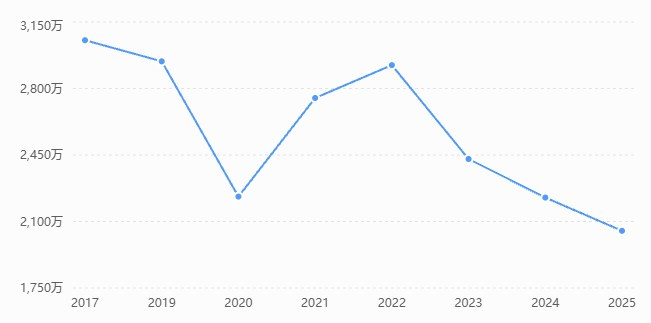
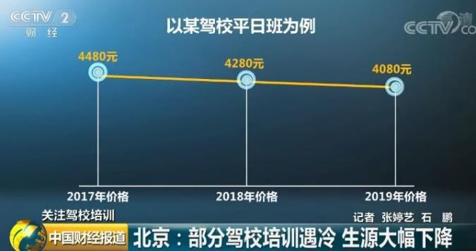

兄弟们，别说卖个车不容易。现在的年轻人，连驾照都不想考了。。。

咱们来看这几年的领证人数，呃，我是说领驾驶证。

除了疫情之后有一波回弹以外，这个数据基本是年年创新低，2017 年还有 3054 万人，2025 年只剩 2051 万人了，8 年锐减了三分之一。

可能很多人会说，现在是不是新生儿少了，没这么多需求了？

不是兄弟，新生人口的拐点是在 2016 年，这批人到现在也才 10 岁，他们考个锤子驾照？

真正能考驾照的年轻人，其实数量还在增加，只是他们不约而同都选择了不考。

具体来说， 25 岁以下的报考占比，已经从五年前的 60% 降到不足 30% ，原因很可能是，大家对考驾照以及买车这件事，都变得更加清醒了。

这当然是个好事儿啊。

拿脖子哥的一大学舍友来说，当年刚考完高考，他就火急火燎考了驾照，不是因为要在大学里开车，而是像完成支线任务一样，先把地图上的问号给消了，免得以后忙了没时间搞，反正技多不压身嘛。

但他后来才发现，从大学到读研，自己都没怎么碰过车，这个驾照基本也是白考了。

更别说，在大城市工作以后，才发现用车成本如此之高，停车费、油/电费、保养、维修加起来，一个月要个千把块钱，还不如天天打车来得香，何况还有地铁。

所以对大多数刚进社会、一穷二白的年轻人来说，真没必要早早染上车瘾。

不过，大家要是都这么想了，驾校行业不就炸锅了？

要知道在 2005-2015 年左右，驾校其实非常的红火，当年很多老板都靠这个赚到了第一桶金，甚至有一家名为 “ 东方时尚 ” 的驾校，直接干到了 A 股上市。

但如今你想再复刻这个套路，恐怕是不行了。

从 2015 年开始，驾校报考人数已经见顶，到 2018 年有近 40% 的教练车，使用率不足一半，说明产业已经严重过剩，于是驾校们经历了一波漫长的降价抢人阶段。

在 2019 年，央视就曝光了北京的驾校培训价格，在两年间从 4480 元降到 4080 元，而有的甚至能开出 3000 元以内的超低价格来抢占市场。

脖子哥坐标杭州，虽然没新闻说的那么夸张，但当年考驾照那会儿，4000 属于是最低价，有些地方会报 5000-6000 ，结果快十年过去了，现在价格还是 4000 左右。

甚至在一些县级和三、四线城市，因为实在卷不动了，驾校们干脆抱团取暖，开始联合涨价。结果就是，交钱又贵、服务又差，真的烂完了。

所以，监管部门很快开始发力。前不久，市场监管总局公布了 2022 年以来全国查处的 12 件驾培行业垄断案件，说的就是这么一回事。

比如，重庆铜梁有 7 家驾校组建了 “ 价格联盟 ” ，强制规定培训费用必须高于 2980 元。如果有哪家成员违反规则，就有相应的惩罚机制，从 10 万元的保证金里面扣。

而且它们连怎么分钱都设计好了，1000 驾校直接拿走，1000 分给教练，另外 980 则是这个联盟的统筹金，这个钱会按照大家的教练车比例做 “ 二次分配 ” 。

这就好比是一个弱者保护机制，假如你今年招生很差，快要倒闭了，但因为有教练车这个数量在，还是会匀到统筹金的一点小保底。

我去，这不挺良心的吗？又保障了利润，又有人情味，为啥要被直接取缔呢？

其实你换个角度再看，驾校们相濡以沫，确实多了点温暖，但最终吃亏的不全是咱们普通消费者嘛。只要有这个价格联盟在，咱们考驾照就压根没得选。

比如隔壁重庆江津，6 家摩托车驾校也搞了个类似的联盟机制，结果培训费水涨船高，从 200 块直接干到了 900 块，这倍率不比炒股赚钱？

更别说，问题的关键还不是涨价，而是抱团，因为这种行为已经涉及到垄断。

在咱们的反垄断法里，就写得明明白白：有竞争关系的经营者，通过协议垄断价格，就是违法。

关键上述案件里面，有超过三成还是行业协会牵头号召的，如果抱团涨价成了行业 “ 潜规则 ” ，那么优胜劣汰的市场规律就不存在了。

你这么搞，以后谁还会优化服务啊，干脆都躺平混着得了呗，反正整个烂场地，找几台破车，照样也能卖高价。

而除了垄断之外，市场监管总局还提到了驾校的各种收费乱象，比如虚假宣传、隐性收费、拒绝退款、学时造假等等，脖子哥老早就听到过不少，只不过在如今这个大环境下，驾校们没什么退路，就更加猖獗了。

前不久，1818 上报道了一位姐妹，因为看到 “ 2980 元全包 ” 的消息，就以为自己捡了个大便宜，兴冲冲去学了，结果考试报名迟迟没报上，驾校还偷偷换号了，后面各种体检费、资料费全都来了。

于是就有了这个在大门口泪崩的镜头。不过嘛，她还算幸运的，前后也就多花几百块。

去年《法治日报》还报道过一个类似的新闻，山东一家驾校先用 “ 2888 元全包 ” 的口号把学员骗进来，实际学车的时候，还要支付 “ 考场模拟费 ” 、“ 考试服务费 ” 等等，额外多花 1300 元，不交这笔钱就不给考试。

更别说你学的时候，还可能遇到一些心术不正的教练，给你塞 20 块钱，暗示你帮他买包好烟。有时候，可能教练不说，有的学员却在私底下各种巴结，你也生怕教练给你穿小鞋对吧？

遇到这种事，真的是不想再考了，真的。

所以这就成了恶性循环，考的人越少，驾校越没钱赚，然后服务越差、套路越多，于是大家就更不想考了。。。

但脖子哥绝对不建议用 “ 抱团涨价 ” 撑住虚假的繁荣，因为行业最本质的问题，还是供需不平衡，从现在的趋势来看，根本看不到任何需求回暖的迹象，甚至再拖个几年，年轻人口可能真的要下降了。

除非你把村里的七大姑八大姨全忽悠来考驾照，到时候难受的可就是教练咯。

其实对行业来说，想要真正脱离乱象，办法相当冷血，就是让那些 “ 垃圾驾校 ” 自己倒闭、合并，留下服务更好、效率更高的驾校，产能重新和学员需求匹配上。

然而目前来看，这还差的很远。

比如在济南，全市一共有 112 所驾校，教练车 5439 辆，场地 188 处，理论上一年能培训 39.2 万人，但 2024 年的实际招生人数只有 10.5 万人，利用率仅 26.8% 。

而且，从这几年的利用率变化来看，驾校的出清速度，也是远远小于学员的减少速度。

原因在于驾校的资产实在太重了，包括教练车、教练员、资质等等，很多老板可能知道行情不好，但前期都投了这么多钱，会觉得 “ 干都干了，再撑几年，说不定会变好 ”。

说白了，驾校真正的倒闭潮可能还没有开始，但或早或晚它都会发生，苦日子还在后头呢。

不过最终挺过来的驾校们，肯定能让行业抬高一个层次。

比如现在很多驾校已经开始推广模拟器训练。毕竟连跑赛道的职业赛车手也靠模拟器训练，那考驾照的初学者们把这玩意儿练会，肯定比什么都不懂，直接上车要学得快。

虽然目前它只作为科目二的前期训练，学员们也就当开了一把地平线，但它在将来或许真能帮助驾校迅速降低成本。

甚至和教练 “ 背点位 ” 的应试教育比，模拟器的 “ 真实道路 ” 反而能练真本事，说不定以后改进一下，就能成为一个主流趋势。

如果说，模拟器广泛应用以后，考个驾照只要千把块学费，不仅玩得很开心，也不用天天讨好教练，我想还是有很多人愿意去考一个试试。

但总的来说，驾校的黄金时代，已经彻底结束了。

撰文：TC

编辑：脖子右拧 & 面线

美编：素描

图片、资料来源：

《中华人民共和国反垄断法》

利剑破除驾培垄断 良序激活下沉市场

济南市机动车驾驶员培训市场信息公告

重庆市市场监督管理局行政处罚决定书（渝市监垄处罚〔2025〕5号）

驾校学费报出"骨折价":低于3000元，咋还招不来学员

“只要交钱就包过”……暑期学车热，警惕“低价包过”坑

原文地址(需上网,纸上看不到点): `https://mp.weixin.qq.com/s/dVBDZRv3Fiii9k2Cbk0wLw`

---

## 认为“SpaceX被低估”，大摩预测“2040年收入达3.5万亿美元”，马斯克回应“不，我估计2033年就能达到”

> 今天 10:22 · finance · 华尔街见闻 全球

_已上头版 F01，此处不重复全文。_

原文地址(需上网,纸上看不到点): `https://wallstreetcn.com/articles/3780524`

---

## 两千多的Mac mini没买，现在新款卖到7000了。。。

> 昨天 00:00 · wechat_mp · 差评X.PIN

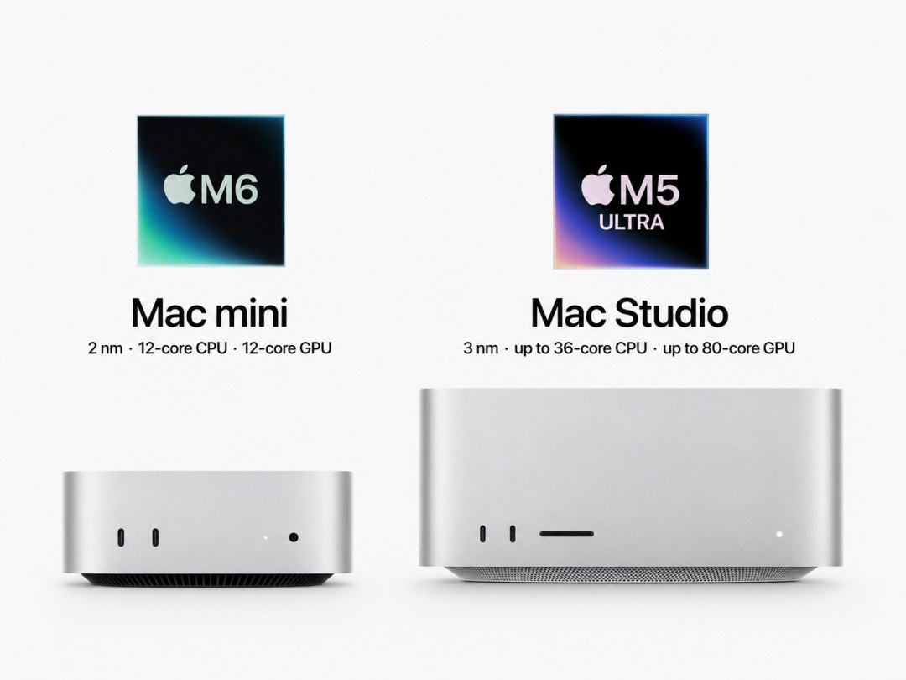

苹果怎么总喜欢悄咪咪整大的。。。

就在昨晚，苹果直接上架了新款的 Mac mini 和 Mac Studio ，单说这俩产品其实是常规升级没啥好聊的，但是哥俩分别搭载了最新的 M6 和 M5 Ultra 芯片 ——

这就有点说头了。

要知道新的 M6 芯片是苹果首款 2nm 工艺，也是消费级 PC 市场最早落地的一批 2nm SoC ，提前给即将到来的秋季新机潮打响了第一枪。。。

至于 M5 Ultra ，托尼记得上一次 M Ultra 还是 M3 时代，那会儿 Studio 同时上 M4 Max 和 M3 Ultra 的事儿搞得很多人吐槽，甚至有人怀疑苹果是不是要放弃 Ultra ，但是你看， M5 Ultra 也王者归来了。

所以今天托尼就从这两款新设备入手，给大家聊聊苹果这俩新芯片到底有哪些新东西。

先说 Mac mini ，大家对这款产品一定不陌生了，托尼觉得它也许是 “ AI 时代最大的受益者之一 ” ，眼睁睁看着 Mac mini M4 的价格从 2000+ 一路涨到 4000+ 。。。

两千多的时候托尼还在犹豫要不要买个回家玩玩，现在已经高攀不起了，肠子都悔青了。

如今 M6 版 Mac mini 终于来了，托尼的心情反而平静了不少 —— 6999 元起，已经不是买不买的问题了，看看就好。

咳咳，龙虾什么的，还是吃点小龙虾吧。

在售价有了长足进步之后，Mac mini M6 带来的第一个重大升级，果然还是 AI 。

以往 SoC 聊 AI 都是把 NPU 单独拎出来说，在 M5 这一代，苹果就已经把神经网络加速器直接塞进每一个 GPU 里面，而 M6 则在这个思路上继续力大飞转。

CPU 和 GPU 都从 10 核增加到 12 核，旁边还安排了两套 16 核神经网络引擎 （ Apple Neural Engine ） 。

利好像是 Photoshop 之类的端侧 AI 处理工作

这样大力的结果是，按照苹果的数据，M6 的 GPU AI 峰值性能比 M5 提升了近 30%，神经网络引擎性能最高翻倍。放到 Mac mini 上，用 LM Studio 跑本地大模型，速度比 M4 版本最高快了 4.8 倍。

大家别拿这点儿算力不当干粮，虽然跑不了爆火的 DeepSeek、Qwen 这些，但是随着苹果端侧 AI 入华，跑个端侧 embedding 模型或者参数更大的 ASR 语音识别模型之类还是不成问题的。

不出意外的话，这就是下一台爆火的 AI 工作站了，即便它很贵。。。

托尼最近还发现，芯片厂商对 AI 的思路正在发生变化，那就是不再只让 NPU 自己闷头搞 AI ，就好比说前两天小米玄戒 O3 就把 AI 单元均匀铺到了 CPU、GPU、ISP、DPU 和 ADSP 等不同模块里边。

两家的具体实现方式并不一样，但都是尽可能调动整颗芯片一起参与 AI 计算。看来以后再评价芯片的 AI 能力，不能只盯着 NPU 的 TOPS 了。。。

说完 AI，再来看看 M6 作为一颗常规处理器，性能到底涨了多少。

前面说过， M6 的 CPU 和 GPU 增加到了 12 核，其中 CPU 由 2 颗超级核心、4 颗性能核心和 6 颗能效核心组成，官方数据多线程性能相比 M5 最高提升 20%，基本属于多塞两个核心、多干两成活，常规升级。

GPU 除了多出两颗核心，几何处理能力也提高了 50% ，对于复杂游戏场景、三维建模和 CAD 这类需要处理大量几何数据的任务，提升应该会挺明显的。

统一内存带宽则从 M5 的 153GB/s 提升至 170GB/s，这就更像是给更强的 GPU 必要的配套升级，也没啥好说的。

至于大家最关心的、 2nm 工艺带来的能效提升，苹果这次说得比较含糊，只强调 M6 拥有业界领先的性能功耗比，并没有给出相较 M5 的具体数字。

不过托尼找到了一份环境报告，说新款 Mac mini M6 开机闲置功耗依然很优秀，只有 3W ，但满载表现如何，还是得等实机到了再给大家测试一番。

唉，今天托尼还注意到大家都很好奇一个问题，为什么苹果把 M6 的首发位置留给了 Mac mini？

其实这个原因并不难猜。

刚更新不久的 MacBook 产品线暂时不方便再动，而 Mac mini 已经接近两年没有升级，甚至直接跳过了 M5。再加上它不受续航限制，又很适合全天运行本地模型和 AI Agent，自然成了苹果试水首代 2nm 芯片最稳妥的平台。

顺带一提，新款 Mac mini 还有 M5 Pro 版本可选。

虽然 M5 Pro 仍然用的是第三代 3nm 制程，但 Pro 毕竟是 Pro。。。最高能选 18 核 CPU、20 核 GPU，64GB 统一内存，内存带宽也来到了 307GB/s ，只不过价格同样很 Pro —— 12999 元起。

各位在座的贵宾，都看到这个价位了，也了解下 19999 起的 Mac Studio 吧。

然而标配的 M5 Max 已经是我们的老朋友了，要了解也是了解 46999 起的 M5 Ultra （ 狗头 ）。

Mac Studio 从 2022 年诞生开始定位就非常明确，在一个比 Mac mini 大不了多少的机身里，塞进工作站级别的性能，面向的都是需要长时间高负载运行的剪辑师、三维设计师、音乐人、开发者和科研人员。

一句话概括， Mac mini 负责小巧全能，Mac Studio 负责火力全开。

这次的新款 Mac Studio 提供 M5 Max 和 M5 Ultra 两种选择，起售价分别为 19999 元和 46999 元。 M5 Max 面向对于大部分专业创作者已经足够了， 而 M5 Ultra 能挑战的极限任务，你可能根本想象不到。。。

就比如说之前我们硬件部就做过一期 Mac Studio M3 Ultra 的视频，虽然已经是上代产品，但无论我们怎么折腾这台主机，好像怎么也摸不到这台机器的性能上限在哪里，相当恐怖。

而 M 的 Ultra 芯片之所以能这么强，秘诀其实一直很朴素：拼。

这里的 “ 拼 ” 不是说把两颗处理器焊在主板上就可以了，而是把多枚芯片晶粒放进同一个封装，再通过超高带宽、超低延迟的接口连接起来。这种设计通常也被称为 Chiplet，或者多晶粒架构。

苹果给自己的连接技术取了个名字，叫 UltraFusion 。

初代 M1 Ultra 采用 5nm 工艺，由两枚 M1 Max 晶粒组成；M2 Ultra 还是 5nm ，同样由两枚 M2 Max 拼接；到了 M3 Ultra，制程升级到 3nm ，内部依然是两枚 M3 Max。

唉，我要说但是了啊，但是这次的 M5 Ultra 不一样！

因为 M5 Max 本身已经是双晶粒设计了，所以 M5 Ultra 再把两枚 M5 Max 连接起来，最终就变成了苹果首款四晶粒芯片。

那这个四晶粒的 M5 Ultra 到底有多狠呢？

最直观的就是， M5 Ultra 相比 M5 Max 的主要规格几乎翻了一倍， CPU 从 18 核增加到 36 核， GPU 从最高 40 核堆到 80 核，统一内存带宽也从 614GB/s 提升至 1.2TB/s 。

已经用上 TB/s 了吗。。。

这个 1.2TB/s 是什么概念呢？它大约是 M6 的 7 倍，也是 M3 Ultra 的 1.5 倍。托尼简单点给大家解释，在多轨 8K 视频同剪、超大三维场景和本地大模型这些场景里，普通电脑还在一盘一盘上菜，M5 Ultra 已经开起了流水席，喂饱核心算力。

外加 M5 Ultra 同样支持最高 512GB 的内存，单看容量，足足相当于 16 张 RTX 5090 的显存总和，甚至比 5 张 RTX PRO 6000 全部加起来还多 32GB。。。

这些对于本地运行数千亿参数的大模型、加载巨型三维工程或者处理海量科研数据来说，都是很有意义的。

其余的性能方面，苹果宣称 M5 Ultra 的 CPU 多线程性能比 M3 Ultra 最高提升 30%，图形性能最高提升 40%，GPU 的 AI 峰值性能更是 M3 Ultra 的 4.5 倍。

现在 512G 内存的配置还不能选，不过拉满 M5 Ultra + 256GB 运存 + 16TB 存储的 Mac Studio ，价格已经来到了 142999 。。。

按照现在 96GB 和 256GB 的差价三万块，顶配的 Mac Studio 估计要去到个十七八。

真要买的话，估计只能让差评君帮我报销了。

玩笑归玩笑，回头看这次更新，两台银色盒子的外观依旧没什么变化，M 系列的两端却一起更进了一步。

M6 抢先把基础款带进 2nm 时代，M5 Ultra 则靠四晶粒架构，补回了缺席一代的顶级性能。一个开启新一轮迭代，另一个重新抬高个人电脑的性能天花板。

至于这些官方数字能够兑现多少，还得等真机测试，但 M 系列的下一代和最强形态，这回算是同时到齐了。

撰文：小柳

编辑：米罗 & 面线

美编：素描

图片、资料来源：

苹果官网

小红书：考神QAQ

抖音：差评硬件部

原文地址(需上网,纸上看不到点): `https://mp.weixin.qq.com/s/AuDcgxnXhebML6LzZsLsKQ`

---

---

# 系统体检

> 生成于 2026-08-28 13:46 CST

**告警 2 项** —— 读报时请扫一眼。

- hotlist_weibo 过去 24h 全失败 · HTTPStatusError("Server error '500 Internal Server Error' for url 'http://127.0.0.1:6688/weibo'\nFor more information check: https://developer.mozilla.org/en-US/docs/Web/HTTP/Status/500")
- 323 篇有正文的未读已积压 450h,该出报了

## 采集失败(24h 跑过但全挂)

这些网今天有跑、但一次都没成功。常见原因:上游挂了、页面改版、Cookie 过期。

- `hotlist_weibo` · runs=1 failed=1 · HTTPStatusError("Server error '500 Internal Server Error' for url 'http://127.0.0.1:6688/weibo'\nFor more information check: https://developer.mozilla.org/en-US/docs/Web/HTTP/Status/500")

## 容量

- 数据库: 10.5 MB
- 未上报纸条目: 1624 · 最老 524.3h(含热榜标题)
- 有正文未读: 323 · 最老 450.3h

## 各网 24h

| collector | runs | ok | fail | new | last_ok |
|---|---:|---:|---:|---:|---|
| `hotlist_bilibili` | 1 | 1 | 0 | 38 | 2026-08-28T02:42:43 |
| `hotlist_douyin` | 1 | 1 | 0 | 43 | 2026-08-28T02:42:43 |
| `hotlist_thepaper` | 1 | 1 | 0 | 20 | 2026-08-28T02:42:44 |
| `hotlist_toutiao` | 1 | 1 | 0 | 50 | 2026-08-28T02:42:44 |
| `hotlist_weibo` ** | 1 | 0 | 1 | 0 | - |
| `hotlist_zhihu` | 1 | 1 | 0 | 29 | 2026-08-28T02:42:42 |
| `rss_bangumi_今日放送` | 2 | 2 | 0 | 16 | 2026-08-28T02:42:50 |
| `rss_thoughts_memo_回答` | 2 | 2 | 0 | 1 | 2026-08-28T02:42:44 |
| `rss_九边` | 3 | 3 | 0 | 12 | 2026-08-28T02:43:01 |
| `rss_人物` | 5 | 1 | 4 | 10 | 2026-08-28T02:43:01 |
| `rss_华尔街日报_世界新闻` | 2 | 2 | 0 | 0 | 2026-08-28T02:42:54 |
| `rss_华尔街日报_市场` | 2 | 2 | 0 | 0 | 2026-08-28T02:42:54 |
| `rss_华尔街日报_科技` | 2 | 2 | 0 | 0 | 2026-08-28T02:42:55 |
| `rss_华尔街见闻_全球` | 2 | 2 | 0 | 43 | 2026-08-28T02:42:56 |
| `rss_差评xpin` | 3 | 3 | 0 | 20 | 2026-08-28T02:43:01 |
| `rss_差评君_回答` | 2 | 2 | 0 | 0 | 2026-08-28T02:42:46 |
| `rss_知乎日报_早报` | 2 | 2 | 0 | 1 | 2026-08-28T02:42:48 |
| `rss_章北海的自然选择` | 4 | 4 | 0 | 0 | 2026-08-28T02:43:01 |
| `rss_辛庄课堂` | 4 | 1 | 3 | 10 | 2026-08-28T02:43:01 |

_`**` 全失败 · `·` 未调度 · `*` 产出骤降_
